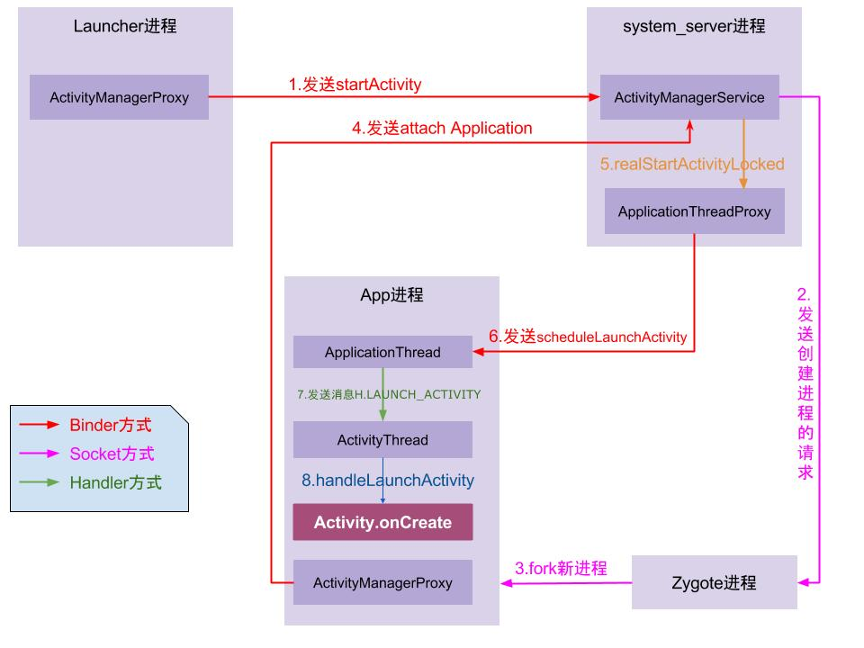

#### 1.Activity的启动流程


**Activity跨进程启动**

https://juejin.im/post/6844903959581163528#heading-1

http://gityuan.com/2016/03/12/start-activity/

启动流程：

点击桌面App图标，Launcher进程采用Binder IPC向system_server进程发起startActivity请求；

system_server进程接收到请求后，向zygote进程发送创建进程的请求；

Zygote进程fork出新的子进程，即App进程；

App进程，通过Binder IPC向sytem_server进程发起attachApplication请求；

system_server进程在收到请求后，进行一系列准备工作后，再通过binder IPC向App进
程发送scheduleLaunchActivity请求；

App进程的binder线程（ApplicationThread）在收到请求后，通过handler向主线程发送LAUNCH_ACTIVITY消息；

主线程在收到Message后，通过发射机制创建目标Activity，并回调Activity.onCreate()等方法。

**Activity进程内启动**

  请求进程A：startActivity—(hook插入点1)
  (AMP，ActivityManager代理对象)——>  
      system_server进程：AMS(ActivityManagerService)

   解析Activity信息、处理启动参数、scheduleLaunchActivity/mH中EXECUTE_TRANSACTION消息处理(Android P)-->

  回到请求进程A：ApplicationThread --> ActivityThread -(hook插入点2)-> Activity生命周期



#### 2.onSaveInstanceState(),onRestoreInstanceState的掉用时机

**onSaveInstanceState(Bundle outState)会在以下情况被调用：**

1、从最近应用中选择运行其他的程序时。

2、当用户按下HOME键时。

3、屏幕方向切换时(无论竖屏切横屏还是横屏切竖屏都会调用)。

4、按下电源按键（关闭屏幕显示）时。

5、从当前activity启动一个新的activity时。

 onPause -> onSaveInstanceState -> onStop。

onSaveInstanceState  android 28之前是在onStop之前， 28之后在onStop之后

**onRestoreInstanceState(Bundle outState)会在以下情况被调用：**

onRestoreInstanceState(Bundle savedInstanceState)只有在activity确实是被系统回收，重新创建activity的情况下才会被调用。

1.屏幕方向切换时，activity生命周期如下

onPause -> onSaveInstanceState -> onStop -> onDestroy -> onCreate -> onStart -> onRestoreInstanceState -> onResume

2.在后台被回收

3.按HOME键返回桌面,又马上点击应用图标回到原来页面时不会被回收

onStart -> onRestoreInstanceState -> onResume

**源码**

 系统会调用ActivityThread的performStopActivity方法中掉用onSaveInstanceState， 将状态保存在mActivities中，mActivities维护了一个Activity的信息表，当Activity重启时候，会从mActivities中查询到对应的ActivityClientRecord。

 如果有信息，则调用Activity的onResoreInstanceState方法，


在ActivityThread的performLaunchActivity方法中，统会判断ActivityClientRecord对象的state是否为空

不为空则通过Activity的onSaveInstanceState获取其UI状态信息，通过这些信息传递给Activity的onCreate方法，

#### 3.activity的启动模式和使用场景


**android任务栈**

  我们每次打开一个新的Activity或者退出当前Activity都会在一个称为任务栈的结构中添加或者减少一个Activity组件，一个任务栈包含了一个activity的集合。

   android通过ActivityRecord、TaskRecord、ActivityStack，ActivityStackSupervisor，ProcessRecord有序地管理每个activity。

**Standard**

默认模式，每次启动Activity都会创建一个新的Activity实例。

**SingleTop**

通知消息打开的页面

如果要启动的Activity已经在栈顶，则不会重新创建Activity，只会调用该该Activity的onNewIntent()方法。

如果要启动的Activity不在栈顶，则会重新创建该Activity的实例。

**SingleTask**

主界面

如果要启动的Activity已经存在于它想要归属的栈中，那么不会创建该Activity实例，将栈中位于该Activity上的所有的Activity出栈，同时该Activity的onNewIntent()方法会被调用。

**SingleInstance**

呼叫来电界面

要创建在一个新栈，然后创建该Activity实例并压入新栈中，新栈中只会存在这一个Activity实例。

#### 4.Activity A跳转Activity B，再按返回键，生命周期执行的顺序

https://www.sohu.com/a/402329833_611601

https://www.jianshu.com/p/6d9d830a758d

在A跳转B会执行：A onPause ->  B onCreate -> B onStart -> B onResume->A onStop

在B按下返回键会执行：B onPause -> A onRestart -> A onStart -> A onResume-> B onStop -> B onDestroy

当A跳转到B的时候，A先执行onPause，然后居然是B再执行onCreate -> onStart -> onResume，最后才执行A的onStop!!!

当B按下返回键，B先执行onPause，然后居然是A再执行onRestart -> onStart -> onResume，最后才是B执行onStop  -> onDestroy!!!

当 B Activity 的 launchMode 为 singleInstance，singleTask 且对应的 B Activity 有可复用的实例时，生命周期回调是这样的:

A.onPause -> B.onNewIntent -> B.onRestart -> B.onStart -> B.onResume -> A.onStop -> ( 如果 A 被移出栈的话还有一个 A.onDestory)

当 B Activity 的 launchMode 为 singleTop且 B Activity 已经在栈顶时（一些特殊情况如通知栏点击、连点），此时只有 B 页面自己有生命周期变化:

B.onPause -> B.onNewIntent -> B.onResume


#### 5.横竖屏切换,按home键,按返回键,锁屏与解锁屏幕,跳转透明Activity界面,启动一个 Theme 为 Dialog 的 Activity，弹出Dialog时Activity的生命周期

**横竖屏切换**：

从 Android 3.2 (API级别 13)开始

https://www.jianshu.com/p/dbc7e81aead2

1、不设置Activity的androidconfigChanges，或设置Activity的androidconfigChanges="orientation"，或设置Activity的android:configChanges="orientation|keyboardHidden"，切屏会重新调用各个生命周期，切横屏时会执行一次，切竖屏时会执行一次。

2、配置 android:configChanges="orientation|keyboardHidden|screenSize"，才不会销毁 activity，且只调用 onConfigurationChanged方法。

竖屏：

启动：onCreat->onStart->onResume.

切换横屏时：

onPause-> onSaveInstanceState ->onStop->onDestory

onCreat->onStart->onSaveInstanceState->onResume.


如果配置这个属性:androidconfigChanges="orientation|keyboardHidden|screenSize"

就不会在调用Activity的生命周期，只会调用onConfigurationChanged方法


**HOME键的执行顺序**：onPause->onStop->onRestart->onStart->onResume

**BACK键的顺序**： onPause->onStop->onDestroy->onCreate->onStart->onResume

**锁屏**：锁屏时只会调用onPause()，而不会调用onStop方法，开屏后则调用onResume()。

**弹出 Dialog**： 直接是通过 WindowManager.addView 显示的（没有经过 AMS），所以不会对生命周期有任何影响。


**启动theme为DialogActivity,跳转透明Activity**

 A.onPause -> B.onCrete -> B.onStart -> B.onResume

（ Activity 不会回调 onStop，因为只有在 Activity 切到后台不可见才会回调 onStop）


https://www.sohu.com/a/402329833_611601


#### 6.onStart 和 onResume、onPause 和 onStop 的区别

onStart 和 onResume  从 Activity  可见可交互区分

onStart 用户可以看到部分activity但不能与它交互
onResume()可以获得activity的焦点，能够与用户交互

onStop 和 onPause 从 Activity 是否位于前台，是否有焦点区分

onPause表示当前页面失去焦点。

onStop表示当前页面不可见。

dialog的主题页面，这个时候，打开着一个页面，就只会执行onPause，而不会执行onStop。

#### 7.Activity之间传递数据的方式Intent是否有大小限制，如果传递的数据量偏大，有哪些方案

startActivity->startActivityForResult->Instrumentation.execStartActivity

->ActivityManger.getService().startActivity

intent中携带的数据要从APP进程传输到AMS进程，再由AMS进程传输到目标Activity所在进程

通过Binder来实现进程间通信


1.Binder 驱动在内核空间创建一个数据接收缓存区。

2.在内核空间开辟一块内核缓存区，建立内核缓存区和内核空间的数据接收缓存区之间的映射关系，以及内核中数据接收缓存区和接收进程用户空间地址的映射关系。

3.发送方进程通过系统调用 copyfromuser() 将数据 copy 到内核空间的内核缓存区，由于内核缓存区和接收进程的用户空间存在内存映射，因此也就相当于把数据发送到了接收进程的用户空间，这样便完成了一次进程间的通信。


 为当使用Intent来传递数据时，用到了Binder机制，数据就存放在了Binder的事务缓冲区里面，而事务缓冲区是有大小限制的。普通的由Zygote孵化而来的用户进程，映射的Binder内存大小是不到1M的

  Binder 本身就是为了进程间频繁-灵活的通信所设计的, 并不是为了拷贝大量数据

如果非 ipc

单例,eventBus,Application,sqlite、shared preference、file 都可以;

如果是 ipc

1.共享内存性能还不错，
通过 MemoryFile 开辟内存空间，获得 FileDescriptor；
将 FileDescriptor 传递给其他进程；
往共享内存写入数据；
从共享内存读取数据。(https://www.jianshu.com/p/4a4bc36000fc)

2.Socket或者管道性能不太好，涉及到至少两次拷贝。

#### 8.Activity的onNewIntent()方法什么时候执行

果IntentActivity处于任务栈的顶端，也就是说之前打开过的Activity，现在处于onPause、onStop 状态的话，其他应用再发送Intent的话，执行顺序为：onNewIntent，onRestart，onStart，onResume。


ActivityA已经启动过,处于当前应用的Activity堆栈中;

当ActivityA的LaunchMode为SingleTop时，如果ActivityA在栈顶,且现在要再启动ActivityA，这时会调用onNewIntent()方法;

当ActivityA的LaunchMode为SingleInstance,SingleTask时,如果已经ActivityA已经在堆栈中，那么此时再次启动会调用onNewIntent()方法;


#### 9.显示启动和隐式启动

**显示启动**

1、构造方法传入Component，最常用的方式

2、setComponent(componentName)方法

3、setClass/setClassName方法

**隐式启动**

https://www.jianshu.com/p/12c6253f1851

隐式Intent是通过在AndroidManifest文件中设置action、data、category，让系统来筛选出合适的Activity

**action的匹配规则**

Intent-filter action可以设置多条

intent中的action只要与intent-filter其中的一条匹配成功即可，且intent中action最多只有一条

Intent-filter内必须至少包含一个action。

**category的匹配规则**

Intent-filter内必须至少包含一个category，android:name为android.intent.category.DEFAULT。

intent-filter中，category可以有多条

intent中，category也可以有多条

intent中所有的category都可以在intent-filter中找到一样的（包括大小写）才算匹配成功

**data的匹配规则**


intent-filter中可以设置多个data

intent中只能设置一个data

intent-filter中指定了data，intent中就要指定其中的一个data

#### 10.scheme使用场景,协议格式,如何使用

scheme是一种页面内跳转协议，是一种非常好的实现机制，通过定义自己的scheme协议，可以非常方便跳转app中的各个页面

 APP根据URL跳转到另外一个APP指定页面

可以通过h5页面跳转app原生页面

服务器可以定制化跳转app页面

Scheme链接格式样式

样式scheme://host/path?query

Uri.parse("hr://test:8080/goods?goodsId=8897&name=test")

hr代表Scheme协议名称

test代表Scheme作用的地址域

8080代表改路径的端口号

/goods代表的是指定页面(路径)

goodsId和name代表传递的两个参数

使用
```
<intent-filter>
        <!-- 协议部分配置 ,注意需要跟web配置相同-->
        <!--协议部分，随便设置 hr://test:8080/goods?name=test  -->
        <data android:scheme="hr"
            android:host="test"
            android:path="/goods"
            android:port="8080"/>
          <!--下面这几行也必须得设置-->
        <category android:name="android.intent.category.DEFAULT" />
        <category android:name="android.intent.category.BROWSABLE" />
        <action android:name="android.intent.action.VIEW" />
    </intent-filter>
```
掉用
```
Intent intent = new Intent(Intent.ACTION_VIEW,Uri.parse("hr://test:8080/goods?name=test"));

startActivity(intent);
```

#### 11.ANR 的四种场景

ANR 的四种场景：

Service TimeOut: service 未在规定时间执行完成：前台服务 20s，后台 200s

BroadCastQueue TimeOut: 未在规定时间内未处理完广播：前台广播 10s 内, 后台 60s 内

ContentProvider TimeOut: publish 在 10s 内没有完成

Input Dispatching timeout: 5s 内未响应键盘输入、触摸屏幕等事件

我们可以看到， Activity 的生命周期回调的阻塞并不在触发 ANR 的场景里面，所以并不会直接触发 ANR。

只不过死循环阻塞了主线程，如果系统再有上述的四种事件发生，就无法在相应的时间内处理从而触发 ANR。


#### 12.onCreate和onRestoreInstance方法中恢复数据时的区别

onSaveInstanceState 不一定会被调用，因为它只有在上次activity被回收了才会调用。

 onCreate()里的Bundle参数可能为空，一定要做非空判断。
而onRestoreInstanceState的Bundle参数一定不会是空值。


#### 13.activty间传递数据的方式

 通过 Intent 传递（Intent.putExtra 的内部也是维护的一个 Bundle，因此，通过 putExtra 放入的  数据，取出时也可以通过 Bundle 去取）

 通过全局变量传递

 通过 SharedPreferences 传递

 通过数据库传递

 通过文件传递

#### 14.跨App启动Activity的方式,注意事项

https://www.jianshu.com/p/ad01ac11b4f1

https://juejin.im/post/6844904056461197326#heading-0

**使用intentFilter(隐式跳转)**

在Manifest的Activity标签中添加：

<activity android:name=".BActivity">
            <intent-filter>
                <category android:name="android.intent.category.DEFAULT" />
                <action android:name="com.example.test.action.BActivity" />
            </intent-filter>
        </activity>

启动时：startActivity(new Intent("com.example.test.action.BActivity"))

如果有两个action属性值相同的Activity，那么在启动时手机系统会让你选择启动哪一个Activity

要解决这个问题，需要给被启动的Activity再加上一个属性<data>，

然后再启动该Activity的Intent中加上一个URI，其中“app”必须与data属性的scheme的值一样，


intent=new Intent("com.zs.appb.intent.action.BeStartActivity", Uri.parse("app://hello"));


**共享uid的App**


android中uid用于标识一个应用程序，uid在应用安装时被分配，并且在应用存在于手机上期间，都不会改变。一个应用程序只能有一个uid，多个应用可以使用sharedUserId 方式共享同一个uid，前提是这些应用的签名要相同。

在AndroidManifest中：manifest标签中添加android:sharedUserId="xxxx"

启动时：startActivity(new Intent().setComponent(new ComponentName("com.example.test","com.example.test.XxxActivity")));

**使用exported**

一旦设置了intentFilter之后，exported就默认被设置为true了

在Manifest中添加exported属性<activity android:name=".BActivity" android:exported="true"/>

启动时：startActivity(new Intent().setComponent(new ComponentName("com.example.zhu","com.example.zhu.XxxActivity")));

**注意(如何防止自己的Activity被外部非正常启动):**

如果AppB设置了android:permission=”xxx.xxx.xx”那么， 就必须在你的AppA的AndroidManifast.xml中uses-permission xxx.xxx.xx才能访问人家的东西。

 给AppA的manifest中添加权限：

<uses-permission android:name="com.example.test"/>

gei AppB中需要启动的Activity添加permission属性：

android:permission="com.example.test"


#### 15.Activity任务栈是什么


1.android任务栈又称为Task，它是一个栈结构，具有后进先出的特性，用于存放我们的Activity组件。

2.我们每次打开一个新的Activity或者退出当前Activity都会在一个称为任务栈的结构中添加或者减少一个Activity组件， 一个任务栈包含了一个activity的集合, 只有在任务栈栈顶的activity才可以跟用户进行交互。

3.在我们退出应用程序时，必须把所有的任务栈中所有的activity清除出栈时,任务栈才会被销毁。当然任务栈也可以移动到后台, 并且保留了每一个activity的状态. 可以有序的给用户列出它们的任务, 同时也不会丢失Activity的状态信息。

4.对应AMS中的ActivityRecord、TaskRecord、ActivityStack(AMS中的总结)


#### 16.有哪些Activity常用的标记位Flags

FLAG_ACTIVITY_NEW_TASK

此标记位作用是为Activity指定“singleTask”启动模式，其效果和在XML中指定相同android:launchMode="singleTask"

FLAG_ACTIVITY_SINGLE_TOP

此标记位作用是为Activity指定“singleTop”启动模式，其效果和在XML中指定相同android:launchMode="singleTop"


FLAG_ACTIVITY_CLEAR_TOP

具有此标记位的Activity，当它启动时，在同一个任务栈中位于它上面的Activity都要出栈。此标记位一般会和singleTask启动模式一起出现，此情况下，若被启动的Activity实例存在，则系统会调用它的onNewIntent。


#### 17.Activity的数据是怎么保存的,进程被Kill后,保存的数据怎么恢复的

https://www.wanandroid.com/wenda/show/12574


 在Activity的onSaveInstanceState方法回调时，put到参数outState（Bundle）里面。outState就是ActivityClientRecord的state。

ActivityClientRecord实例，都存放在ActivityThread的mActivities里面。

Activity变得不可见时（onSaveInstanceState和onStop回调之后），在应用进程这边会通过ActivityTaskManagerService的activityStopped方法，把刚刚在onSaveInstanceState中满载了数据的Bundle对象，传到系统服务进程那边！ 然后（在系统服务进程这边），会进一步将这个Bundle对象，赋值到对应ActivityRecord的icicle上


ActivityRecord是用来记录对应Activity的各种信息的，如theme，启动模式、当前是否可见等等（为了排版更简洁，上图只列出来一个icicle），它里面还有很多管理Activity状态的相关方法；

TaskRecord就是大家耳熟能详的任务栈（从上图可以看出并不真的是栈）了，它的主要职责就是管理ActivityRecord。每当Activity启动时，会先找到合适的TaskRecord（或创建新实例），然后将该Activity所对应的ActivityRecord添加到TaskRecord的mActivities中；

ActivityStack管理着TaskRecord，当新TaskRecord被创建后，会被添加到它mTaskHistory里面。