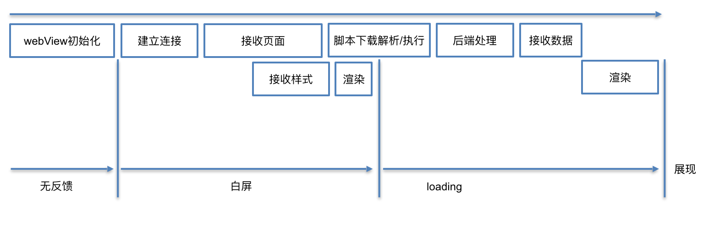

####  1.如何提高WebView加载速度

https://tech.meituan.com/2017/06/09/webviewperf.html

WebView启动过程大概分为以下几个阶段：

 

App中打开WebView的第一步并不是建立连接，而是启动浏览器内核。

**1.优化手段围绕着以下两个点进行**

预加载WebView。

加载WebView的同时，请求H5页面数据。

**2.常见的方法是**

**全局WebView**

在客户端刚启动时，就初始化一个全局的WebView待用，并隐藏；

这种方法可以比较有效的减少WebView在App中的首次打开时间。当用户访问页面时，不需要初始化WebView的时间。

当然这也带来了一些问题，包括：

额外的内存消耗。

页面间跳转需要清空上一个页面的痕迹，更容易内存泄露。

**客户端代理页面请求WebView初始化完成后向客户端请求数据**

在客户端初始化WebView的同时，直接由native开始网络请求数据；

当页面初始化完成后，向native获取其代理请求的数据。

**asset存放离线包。**

**3.除此之外还有一些其他的优化手段：**

**DNS和链接慢**

想办法复用客户端使用的域名和链接，可以让客户端复用使用的域名与链接。

DNS采用和客户端API相同的域名

DNS会在系统级别进行缓存，对于WebView的地址，如果使用的域名与native的API相同，则可以直接使用缓存的DNS而不用再发起请求图片。

**脚本执行慢**

可以把框架代码拆分出来，在请求页面之前就执行好。

**后端处理慢**

可以让服务器分trunk输出，在后端计算的同时前端也加载网络静态资源。

####  2.WebView与 js的交互

https://blog.csdn.net/carson_ho/article/details/64904691

 **Android去调用JS的代码**

1.通过WebView的loadUrl（）

2.通过WebView的evaluateJavascript（）

**JS调用Android代码的方法**

1.通过WebView的addJavascriptInterface（）进行对象映射

2.通过 WebViewClient 的shouldOverrideUrlLoading ()方法回调拦截 url

3.Android通过 WebChromeClient 的onJsAlert()、onJsConfirm()、onJsPrompt（方法回调分别拦截JS对话框（即上述三个方法），得到他们的消息内容，然后解析即可。

####  3.WebView的漏洞

https://blog.csdn.net/carson_ho/article/details/64904635

**任意代码执行漏洞**

JS调用Android的可以通过addJavascriptInterface接口进行对象映射

当JS拿到Android这个对象后，就可以调用这个Android对象中所有的方法，包括系统类（java.lang.Runtime 类），从而进行任意代码执行。

 java.lang.Runtime 类，可以执行本地命令的

 解决

对于Android 4.2以前，需要采用**拦截prompt（）**的方式进行漏洞修复

原理

每次当 WebView 加载页面前加载一段本地的 JS 代码，

让JS调用一Javascript方法：该方法是通过调用prompt（）把JS中的信息（含特定标识，方法名称等）传递到Android端；

在Android的onJsPrompt（）中 ，解析传递过来的信息，再通过反射机制调用Java对象的方法，这样实现安全的JS调用Android代码。

对于Android 4.2以后，则只需要对被调用的函数以 @JavascriptInterface进行注解

**密码明文存储漏洞**

WebView默认开启密码保存功能

原因 WebView默认开启密码保存功能：mWebView.setSavePassword(true) 开启后，在用户输入密码时，会弹出提示框：询问用户是否保存密码； 如果选择”是”，密码会被明文保到 /data/data/com.package.name/databases/webview.db 中，这样就有被盗取密码的危险 解决 关闭密码保存提醒：WebSettings.setSavePassword(false)

**域控制不严格漏洞**

当其他应用启动可以允许外部调用的Activity 时， intent 中的 data 直接被当作 url 来加载（假定传进来的 url 为 file:///data/local/tmp/attack.html ），其他 APP 通过使用显式 ComponentName 或者其他类似方式就可以很轻松的启动该 WebViewActivity 并加载恶意url。

对于不需要使用 file 协议的应用，禁用 file 协议；
// 禁用 file 协议；
setAllowFileAccess(false);
setAllowFileAccessFromFileURLs(false);
setAllowUniversalAccessFromFileURLs(false);

对于需要使用 file 协议的应用，禁止 file 协议加载 JavaScript。

####  4.JsBridge原理

https://juejin.cn/post/6844903585268891662#heading-0

https://www.jianshu.com/p/910e058a1d63

1.优点

1.JavaScript 端可以确定 JSBridge 的存在，直接调用即可

2.H5同时适配Android和iOS两个平台

3.java与js的交互存在一些安全漏洞

2.原理

**JavaScript 调用 Native**

注入 API 和 拦截 URL SCHEME。

 **注入API**

在 4.2 之前，Android 注入 JavaScript 对象的接口是 addJavascriptInterface，但是这个接口有漏洞，可以被不法分子利用，危害用户的安全，因此在 4.2 中引入新的接口 @JavascriptInterface（上面代码中使用的）来替代这个接口，解决安全问题。所以 Android 注入对对象的方式是 有兼容性问题的。

**拦截 URL SCHEME**

mWebView.registerHandler("startload", (data, function) -> {  function.onCallBack("aaaaa");});

1.初始化webview时,将WebViewJavascriptBridge.js文件注入页面。向body中添加一个不可见的iframe元素。通过改变一个不可见的iframe的src就可以让webview拦截到url，而用户是无感知的。

2.Web 端通过某种方式（例如 iframe.src）发送 URL Scheme 请求，通过shouldOverrideUrlLoading来拦截约定规则的Ur

**Native 调用 JavaScript**

mWebView.callHandler("test", mJson, data -> LogUtil.d(回调:" + data));

webView.loadUrl("javascript:" + javaScriptString);

dosend发送消息时,带上callId，如果Js在调用Handler的时候设置了回调方法，会调用queueMessage的方法，然后往下就是走Native给Js发送消息的步骤。

