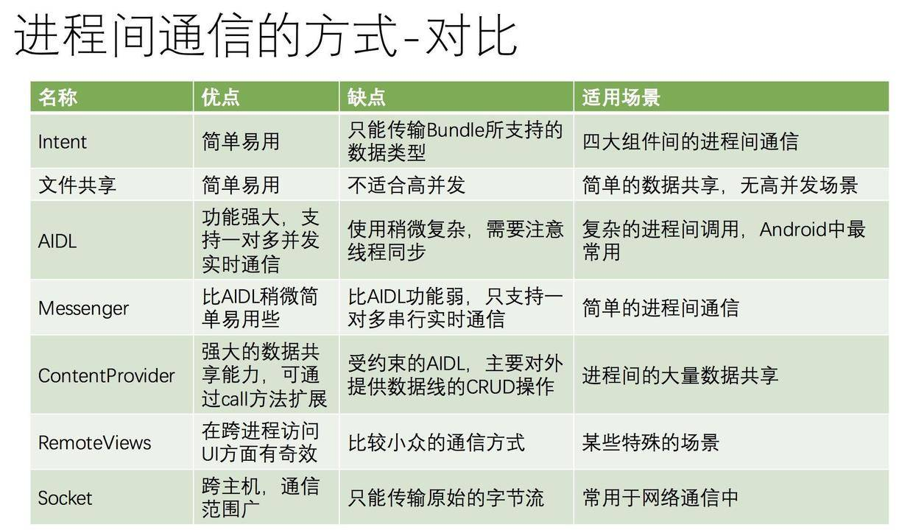
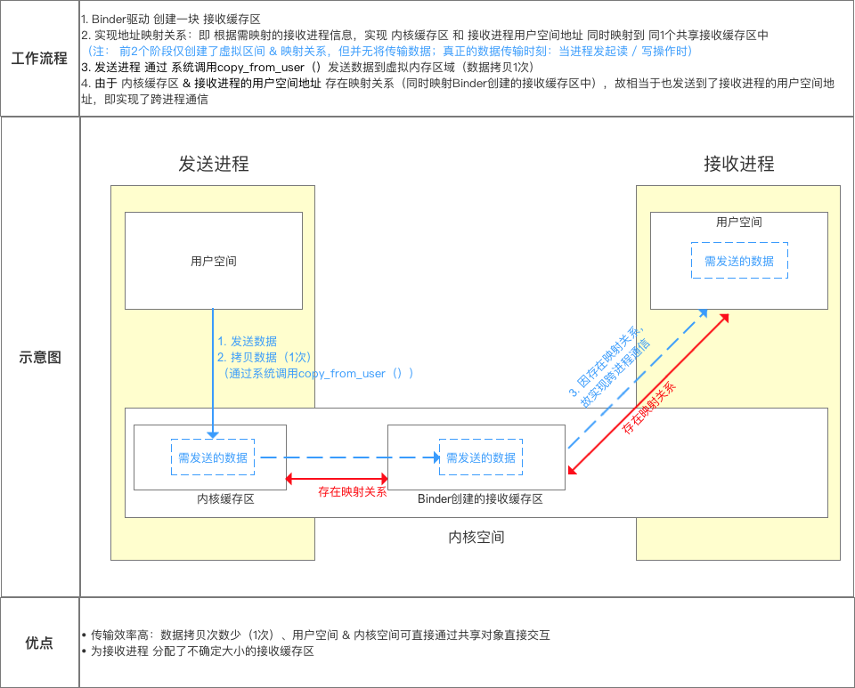
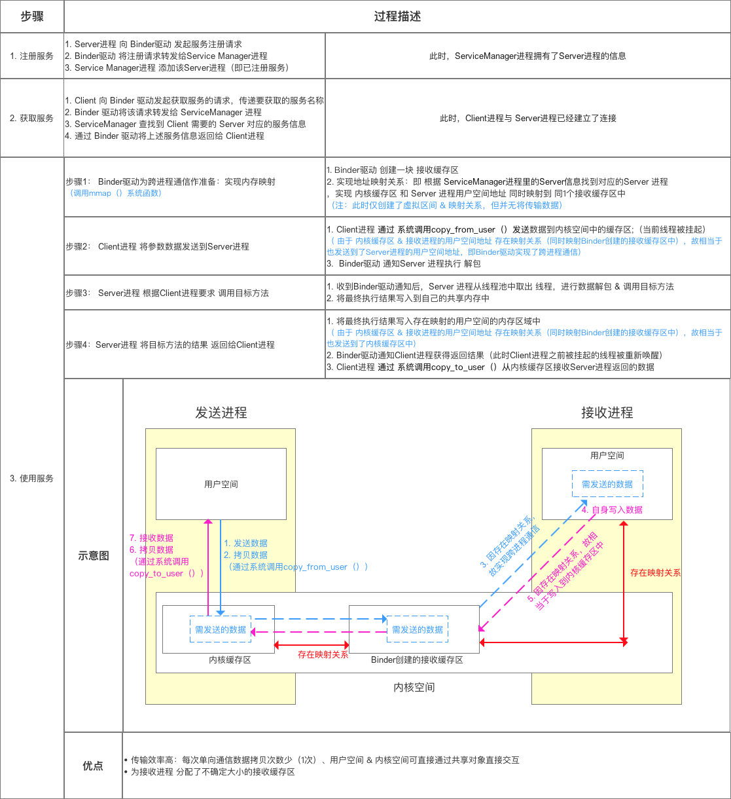
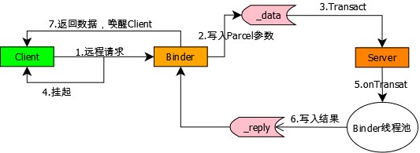
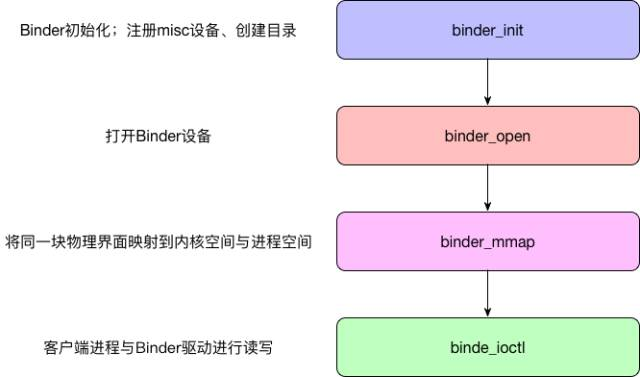

https://juejin.im/post/6844903589635162126#heading-1  
https://blog.csdn.net/carson_ho/article/details/73560642  
https://www.colabug.com/2019/0421/6041679/  
https://juejin.im/post/6844903469971685390#heading-0


#####  1.Android中进程和线程的关系,区别

1、进程是什么？  
    它是系统进行资源分配和调度的一个独立单位,也就是说进程是可以独立运行的一段程序。  
2、线程又是什么？  
  线程进程的一个实体，是CPU调度和分派的基本单位，他是比进程更小的能独立运行的基本单位,线程自己基本上不拥有系统资源。在运行时，只是暂用一些计数器、寄存器和栈 。
 

1、进程有不同的代码和数据空间，而多个线程则共享数据空间，每个线程有自己的执行堆栈和程序计数器为其执行上下文。  
2、进程间相互独立，同一进程的各线程间共享。   
3、进程间通信IPC，线程间可以直接读写进程数据段（如全局变量）来进行通信——需要进程同步和互斥手段的辅助，以保证数据的一致性。  
 

#####  2.为何需要进行IPC,多进程通信可能会出现什么问题


  为了保证进程空间不被其他进程破坏或干扰，Linux中的进程是相互独立或相互隔离的。在Android系统中一个应用默认只有一个进程，每个进程都有自己独立的资源和内存空间，其它进程不能任意访问当前进程的内存和资源。这样导致在不同进程的四大组件没法进行通信，线程间没法做同步，静态变量和单例也会失效。所以需要有一套IPC机制来解决进程间通信、数据传输的问题。


开启多进程虽简单，但会引发如下问题，必须引起注意。  
1.静态成员和单例模式失效  
2.线程同步机制失效  
3.SharedPreferences 可靠性降低  
4.Application 被多次创建  
对于前两个问题，可以这么理解，在Android中，系统会为每个应用或进程分配独立的虚拟机，不同的虚拟机自然占有不同的内存地址空间，所以同一个类的对象会产生不同的副本，导致共享数据失败，必然也不能实现线程的同步。
由于SharedPreferences底层采用读写XML的文件的方式实现，多进程并发的的读写很可能导致数据异常。
Application被多次创建和前两个问题类似，系统在分配多个虚拟机时相当于把同一个应用重新启动多次，必然会导致 Application 多次被创建，为了防止在 Application
中出现无用的重复初始化，可使用进程名来做过滤，只让指定进程的才进行全局初始：

```
public class MyApplication extends Application{
    @Override
    public void onCreate() {
        super.onCreate();
        String processName = "com.shh.ipctest";
        if (getPackageName().equals(processName)){
            // do some init
        }
    }
}
 ```

##### 3.Android中IPC方式有几种、各种方式优缺点
   


##### 4.为何新增Binder来作为主要的IPC方式

 Android也是基于Linux内核，Linux现有的进程通信手段有管道/消息队列/共享内存/套接字/信号量。

既然有现有的IPC方式，为什么重新设计一套Binder机制呢

主要是出于以上三个方面的考量：

1、效率：传输效率主要影响因素是内存拷贝的次数，拷贝次数越少，传输速率越高。从Android进程架构角度分析：对于消息队列、Socket和管道来说，数据先从发送方的缓存区拷贝到内核开辟的缓存区中，再从内核缓存区拷贝到接收方的缓存区，一共两次拷贝。

一次数据传递需要经历：用户空间 –> 内核缓存区 –> 用户空间，需要2次数据拷贝，这样效率不高。

而对于Binder来说，数据从发送方的缓存区拷贝到内核的缓存区，而接收方的缓存区与内核的缓存区是映射到同一块物理地址的，节省了一次数据拷贝的过程 ：
共享内存不需要拷贝，Binder的性能仅次于共享内存。


2、稳定性：上面说到共享内存的性能优于Binder，那为什么不采用共享内存呢，因为共享内存需要处理并发同步问题，容易出现死锁和资源竞争，稳定性较差。 Binder基于C/S架构 ，Server端与Client端相对独立，稳定性较好。

3、安全性：传统Linux IPC的接收方无法获得对方进程可靠的UID/PID，从而无法鉴别对方身份；而Binder机制为每个进程分配了UID/PID，且在Binder通信时会根据UID/PID进行有效性检测。

##### 5.什么是Binder

从进程间通信的角度看，Binder 是一种进程间通信的机制；

从 Server 进程的角度看，Binder 指的是 Server 中的 Binder 实体对象(Binder类 IBinder)；

从 Client 进程的角度看，Binder 指的是对 Binder 代理对象，是 Binder 实体对象的一个远程代理

从传输过程的角度看，Binder 是一个可以跨进程传输的对象；Binder 驱动会自动完成代理对象和本地对象之间的转换。

从Android Framework角度来说，Binder是ServiceManager连接各种Manager和相应ManagerService的桥梁
Binder跨进程通信机制：基于C/S架构，由Client、Server、ServerManager和Binder驱动组成。

进程空间分为用户空间和内核空间。用户空间不可以进行数据交互；内核空间可以进行数据交互，所有进程共用一个内核空间

Client、Server、ServiceManager均在用户空间中实现，而Binder驱动程序则是在内核空间中实现的；


##### 6.Binder的原理<br/>&nbsp;&nbsp;&nbsp;Binder Driver 如何在内核空间中做到一次拷贝的


进程空间分为用户空间和内核空间。用户空间不可以进行数据交互；内核空间可以进行数据交互，所有进程共用一个内核空间。

应用程序不能直接操作设备硬件地址,如果用户空间需要读取磁盘的文件，
如果不采用内存映射， 需要两次拷贝（磁盘-->内核空间-->用户空间）；

内存映射将用户空间的一块内存区域映射到内核空间。映射关系建立后，内核空间对这段区域的修改也能直接反应到用户空间,少了一次拷贝。

  Binder 驱动使用 mmap()  在内核空间创建数据接收的缓存空间。
  mmap(NULL, MAP_SIZE, PROT_READ, MAP_PRIVATE, fd, 0)的返回值是内核空间映射在用户空间的地址


1.Binder 驱动在内核空间创建一个数据接收缓存区。

2.在内核空间开辟一块内核缓存区，建立内核缓存区和内核空间的数据接收缓存区之间的映射关系，以及内核中数据接收缓存区和接收进程用户空间地址的映射关系。

3.发送方进程通过系统调用 copyfromuser() 将数据 copy 到内核空间的内核缓存区，由于内核缓存区和接收进程的用户空间存在内存映射，因此也就相当于把数据发送到了接收进程的用户空间，这样便完成了一次进程间的通信。

  
  


##### 7.使用Binder进行数据传输的具体过程


系统层面:

注册服务

服务进程向Binder进程发起服务注册

Binder驱动将注册请求转发给ServiceManager进程

ServiceManager进程添加这个服务进程

获取服务

用户进程向Binder驱动发起获取服务的请求，传递要获取的服务名称Binder驱动

将该请求转发给ServiceManager进程

ServiceManager进程查到到用户进程需要的服务进程信息最后

通过Binder驱动将上述服务信息返回个用户进程


使用服务

1.Binder通过内存映射建立数据缓存区

2.根据ServiceManager查到的服务的进程和数据缓存区 , 数据缓存区和client进程的内存缓存区建立映射

3.client掉用copy_from_user数据到内存缓存区

4.收到binder启动后服务进程根据用户进程要求调用目标方法

5.服务进程将目标方法的结果返回给用户进程


 


具体代码层面:

1、服务端中的Service给客户端提供Binder对象

2、客户端通过AIDL接口中的asInterface()将这个Binder对象转换为代理Proxy并通过它发起RPC请求

3、client进程的请求数据data通过代理binder对象的transact方法，发送到内核空间，当前线程被挂起

4、server进程收到binder驱动通知， onTransact(在线程池中进行数据反序列化&调用目标方法)处理客户端请求，并将结果写入reply

5、Binder驱动将server进程的目标方法执行结果，拷贝到client进程的内核空间

6、Binder驱动通知client进程，之前挂起的线程被唤醒，并收到返回结果

   


#####  8.Binder框架中ServiceManager的作用

ServiceManager使得客户端可以获取服务端binder实例对象的引用


#####  9.什么是AIDL
 AIDL是android提供的接口定义语言，简化Binder的使用 ， 轻松地实现IPC进程间通信机制。 AIDL会生成一个服务端对象的代理类，通过它客户端可以实现间接调用服务端对象的方法。
   
#####  10.AIDL使用的步骤

 书写 AIDL

创建要操作的实体类，实现 Parcelable 接口，以便序列化/反序列化

新建 aidl 文件夹，在其中创建接口 aidl 文件以及实体类的映射 aidl 文件

Make project ，生成 Binder 的 Java 文件

编写服务端

创建 Service，在Service中创建生成的Stub实例，实现接口定义的方法

在 onBind() 中返回Binder实例

编写客户端

实现 ServiceConnection 接口，在其中通过asInterface拿到 AIDL 类

bindService()

调用 AIDL 类中定义好的操作请求   

#####  11.AIDL支持哪些数据类型

Java八种基本数据类型(int、char、boolean、double、float、byte、long、string) 但不支持short

String、CharSequence

List和Map，List接收方必须是ArrayList，Map接收方必须是HashMap

实现Parcelable的类	

#####  12.AIDL的关键类，方法和工作流程

Client和Server都使用同一个AIDL文件，在AIDL 编译后会生成java文件 ,其中有Stub服务实体和Proxy服务代理两个类  

AIDL接口：编译完生成的接口继承IInterface。  

Stub类：
服务实体，Binder的实现类，服务端一般会实例化一个Binder对象，在服务端onBind中绑定，  
客户端asInterface获取到Stub。  
这个类在编译aidl文件后自动生成，它继承自Binder，表示它是一个Binder本地对象；它是一个抽象类，实现了IInterface接口，表明它的子类需要实现Server将要提供的具体能力（即aidl文件中声明的方法）。

Stub.Proxy类：
服务的代理，客户端asInterface获取到Stub.Proxy。  
它实现了IInterface接口，说明它是Binder通信过程的一部分；它实现了aidl中声明的方法，但最终还是交由其中的mRemote成员来处理，说明它是一个代理对象，mRemote成员实际上就是BinderProxy。

asInterface()：客户端在ServiceConnection通过Person.Stub.asInterface(IBinder)， 
 会根据是同一进行通信，还是不同进程通信，返回Stub()实体，或者Stub.Proxy()代理对象  

 transact()：运行在客户端，当客户端发起远程请求时，内部会把信息包
 装好，通过transact()向服务端发送。并将当前线程挂起，
  Binder驱动完成一系列的操作唤醒 Server 进程  ，调用 Server 进程本地对象的 onTransact()来调用相关函数 。
  到远程请求返回，当前线程继续执行。

onTransact()：运行在服务端的Binder线程池中，当客户端发起跨进程请求时，
onTransact()根据 Client传来的 code 调用相关函数  。调用完成后把数据写入Parcel，通过reply发送给Client。 
驱动唤醒 Client 进程里刚刚挂起的线程并将结果返回。   

   

#####  13.如何优化多模块都使用AIDL的情况
每个业务模块创建自己的AIDL接口并创建Stub的实现类，向服务端提供自己的唯一标识和实现类。

服务端只需要一个Service，创建Binder连接池接口,跟据业务模块的特征来返回相应的Binder对象.

客户端掉 用时通过Binder连接池，
即将每个业务模块的Binder请求统一转发到一个远程Service中去执行，
从而避免重复创建Service。

https://blog.csdn.net/it_yangkun/article/details/79888900


#####  14.使用 Binder 传输数据的最大限制是多少，被占满后会导致什么问题
因为Binder本身就是为了进程间频繁而灵活的通信所设计的，并不是为了拷贝大数据而使用的。比如在Activity之间传输BitMap的时候，如果Bitmap过大，就会引起问题，比如崩溃等，这其实就跟Binder传输数据大小的限制有关系

mmap函数会为Binder数据传递映射一块连续的虚拟地址，这块虚拟内存空间其实是有大小限制。

普通的由Zygote孵化而来的用户进程，所映射的Binder内存大小是不到1M的，准确说是 110241024) - (4096 *2)

```
#define BINDER_VM_SIZE ((1*1024*1024) - (4096 *2))
```

 特殊的进程ServiceManager进程，它为自己申请的Binder内核空间是128K，这个同ServiceManager的用途是分不开的，ServcieManager主要面向系统Service，只是简单的提供一些addServcie，getService的功能，不涉及多大的数据传输，因此不需要申请多大的内存：

```
 bs = binder_open(128*1024);
```

 当服务端的内存缓冲区被Binder进程占用满后，Binder驱动不会再处理binder调用并在c++层抛出DeadObjectException到binder客户端


#####  15.Binder 驱动加载过程中有哪些重要的步骤
从 Java 层来看就像访问本地接口一样，客户端基于 BinderProxy 服务端基于 IBinder 对象 。

在Native层有一套完整的binder通信的C/S架构，Bpinder作为客户端，BBinder作为服务端。基于naive层的Binder框架，Java也有一套镜像功能的binder C/S架构，通过JNI技术，与native层的binder对应，Java层的binder功能最终都是交给native的binder来完成。

从内核看跨进程通信的原理最终是要基于内核的，所以最会会涉及到 binder_open 、binder_mmap 和 binder_ioctl这三种系统调用。

  


#####  16.系统服务与bindService启动的服务的区别

服务可分为系统服务与普通服务，系统服务一般是在系统启动的时候，由SystemServer进程创建并注册到ServiceManager中 例如AMS，WMS，PMS。而普通服务一般是通过ActivityManagerService启动的服务，或者说通过四大组件中的Service组件启动的服务。不同主要从以下几个方面：

服务的启动方式
系统服务这些服务本身其实实现了Binder接口，作为Binder实体注册到ServiceManager中，被ServiceManager管理。这些系统服务是位于SystemServer进程中

普通服务一般是通过Activity的startService或者其他context的startService启动的，这里的Service组件只是个封装，主要的是里面Binder服务实体类，这个启动过程不是ServcieManager管理的，而是通过ActivityManagerService进行管理的，同Activity管理类似


服务的注册与管理

系统服务一般都是通过ServiceManager的addService进行注册的，这些服务一般都是需要拥有特定的权限才能注册到ServiceManager，而bindService启动的服务可以算是注册到ActivityManagerService，只不过ActivityManagerService管理服务的方式同ServiceManager不一样，而是采用了Activity的管理模型


服务的请求使用方式

使用系统服务一般都是通过ServiceManager的getService得到服务的句柄，这个过程其实就是去ServiceManager中查询注册系统服务。而bindService启动的服务，主要是去ActivityManagerService中去查找相应的Service组件，最终会将Service内部Binder的句柄传给Client


#####  17.Activity的bindService流程

1、Activity调用bindService：通过Binder通知ActivityManagerService，要启动哪个Service

2、ActivityManagerService创建ServiceRecord，并利用ApplicationThreadProxy回调，通知APP新建并启动Service启动起来

3、ActivityManagerService把Service启动起来后，继续通过ApplicationThreadProxy，通知APP，bindService，其实就是让Service返回一个Binder对象给ActivityManagerService，以便AMS传递给Client

4、ActivityManagerService把从Service处得到这个Binder对象传给Activity，这里是通过IServiceConnection binder实现。

5、Activity被唤醒后通过Binder Stub的asInterface函数将Binder转换为代理Proxy，完成业务代理的转换，之后就能利用Proxy进行通信了。


#####  18.不通过AIDL，手动编码来实现Binder的通信

