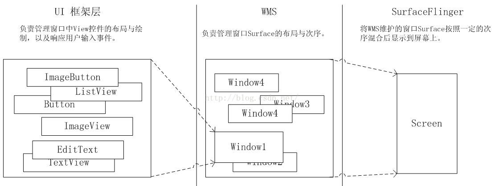
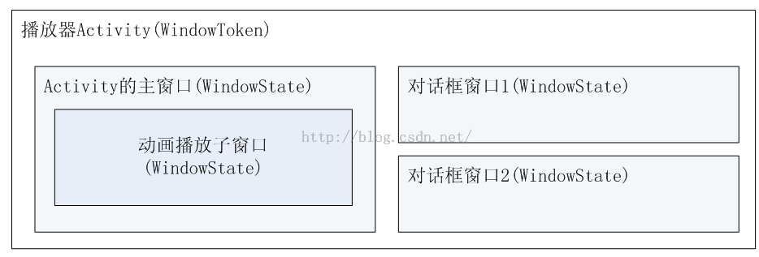
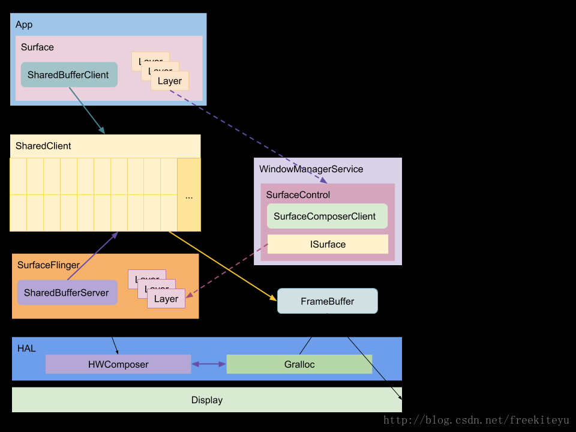

参考文章:  
http://skyacer.github.io/archives/  
https://wizardforcel.gitbooks.io/deepin-android-vol3/content/4.html  
 http://liuwangshu.cn/system/

https://blog.csdn.net/itachi85/article/details/78186741
http://liuwangshu.cn/system/
https://coding.imooc.com/class/chapter/340.html#Anchor
https://blog.csdn.net/freekiteyu/article/details/79483406

 
**1.什么是WMS**  
 WMS（WindowManagerService）是负责Android的窗口的管理的服务，比如窗口的添加、移除、调整顺序等等。
 它运行在System_server进程，作为服务端，客户端（应用程序）通过IPC调用和它进行交互
 是管理接口WindowManager的真正的实现类，至于图像的绘制图像绘制的是SurfaceFlinger(Android UI渲染体系的核心)服务。
 他主要有四个职责:

 (1).窗口管理:  
 它负责窗口的添加,删除和修改，另外窗口的大小和层级也是由WMS进行管理的

(2).分配Surface  
  窗口不具备绘制功能，因此每个窗口都需要有一块 Surface 来供自己绘制，为每个窗口分配 Surface 是由WMS 来完成的。
   为所有窗口分配Surface。客户端向WMS添加一个窗口的过程，其实就是WMS为其分配一块Suiface的过程，
   一块块Surface在WMS的管理下有序的排布在屏幕上。Window的本质就是 Surface。

(3).管理窗口动画  
   窗口间进行切换时，使用窗口动画可以显得更炫一些，窗口动画由WMS的动画子系统WindowAnimator来负责。

(4).输入系统中转站  
通过对窗口的触摸从而产生触摸事件，InputManagerService(IMS) 会对触摸事件进行处理，它会寻找一个最合适的窗口来处理触摸反馈信息，WMS 是窗口的管理者，它作为输入系统的中转站再合适不过了。

 

**2.WMS是如何管理Window的**
 
 
1.setContentView把layoutResID 添加到 decorView中.
在Activity启动过程中会调用ActivityThread->performLaunchActivity->Activity的attach方法,attach创建了PhoneWindow
之后PhoneWindow对象里面添加了一个DecorView

2.DecorView绑定一个ViewRootImpl，获取 IWindowSession 和 WMS 实例。 

3.ViewRootImpl将Session将请求委托给WMS， 并向 WMS 添加一个WindowToken和注册窗口。

4.向 WMS 申请对窗口进行 ReLayout。也就是根据窗口新的属性去调整其 Surface 相关的属性，
由SurfaceFlinger分配Surface。向 WMS 添加窗口之后，仅仅是将其在 WMS 中进行了注册，
只有经过重新布局，窗口才拥有 WMS 为其分配的画布

5.App客户端调用View.onDraw方法进行绘制

6.绘制完之后，SurfaceFlinger就会按照WMS里面提供的层级等信息进行合成，最终显示

**3.IWindowSession是什么，WindowSession的创建过程是怎样的**  
 它是一个Binder对象，用于进行进程间通信，IWindowSession是Client端的代理，它的Server端的实现为Session，
  ViewRootImpl通过IWindowSession向WMS发起Binder调用，而WMS也会通过IWindow向应用端发起调用
 每个应用程序进程都会对应一个Session，其他的应用程序进程想要和WMS进程进行通信就需要经过Session。
创建：在WindowManager的addView中会创建ViewRootImpl，内部会通过WMS去获取WindowSession
WindowSession的类型是IWindowSession，本身是Binder对象，真正实现类是Session

**4.WindowToken是什么**  
1会将相同组件（比如Acitivity）的窗口（WindowState）集合在一起，方便管理。
例如在进行窗口ZOrder排序时，属于同一个WindowToken的窗口会被安排在一起。  
2.对于显示组件（客户端）而言的Token，是任意一个Binder的实例，使用addWindowToken()函数声明Token
，将会在WMS中创建一个WindowToken实例
对于WMS而言是窗口令牌，Wms用它唯一标识系统中的一个窗口， 每个窗口都需要一种token以识别身份，
当应用程序想要向WMS申请新创建一个窗口，则需要向WMS出示有效的WindowToken。 
应用程序中每个Activity都对应一个AppWindowToken。

**5.WindowState是什么**  
 WindowState表示一个窗口的所有属性，所以它是WMS中事实上的窗口  
   

**6.Android窗口大概分为几种？分组原理是什么**  
应用窗口（拥有自己的WindowToken） 例如：Activity与Dialog
子窗口（必须依附到其他非子窗口才能存在，比如Activity等） 例如：PopupWindow
系统窗口 例如：Toast
窗口是以token来分组的,windowToken包含一个WindowList，包含一系列的WindowState
应用窗口
Activity的Window类型是TYPE_APPLICATION，在WMS有一个唯一的AppWindowToken与之对应。
Dialog的Window类型也是TYPE_APPLICATION，Dialog和其所在的Activity共用一个AppWindowToken。
子窗口
PopupWindow的Window类型是TYPE_APPLICATION_PANEL,PopupWindow和其所在的Activity共用一个AppWindowToken。
系统窗口
Toast的Window类型是TYPE_TOAST，Toast的token是由NotificationManagerService创建的，
每个Toast对应一个自己的token，Toast的token在WMS对应的是WindowToken。
 每一种类型都有int常量标识，wms进行窗口叠加的时候会按照该int常量的大小分配不同层，int值越大层位置越靠上面。
 
**7.Dialog的Context只能是Activity的Context，不能是Application的Context**  
 Dialog初始化时是通过Context.getSystemServer来获取WindowManager
如果用Application或者Service的Context去获取这个WindowManager服务的话,token是空的,
之后在Dialog的show方法中将Dialog的View添加到WindowManager时会给token设置默认值还是null.
如果这个Context是Activity，则直接返回Activity的mWindowManager，
这个mWindowManager在Activity的attach方法被创建，token指向此Activity的token
从而获得WMS添加窗口的许可。这

 

**8.App应用程序如何与SurfaceFlinger通信的**

**View 的绘制是如何把数据传递给 SurfaceFlinger 的？**

  Android应用程序需要传递给SurfaceFlinger服务的UI元数据是相当可观的。
  在这种情况下，通过Binder来在Android应用程序与SurfaceFlinger服务之间传递UI元数据是不合适的，因此这里选择了匿名共享内存的方案。在每一个Android应用程序与SurfaceFlinger服务之间的连接上加上一块用来传递UI元数据的匿名共享内存。这块区域被包装为SharedClient。
  在 App 进程中创建 PhoneWindow 后会创建 ViewRoot。ViewRoot 的创建会创建一个 Surface，
  这个 Surface 其实是空的，通过与 WindowManagerService 通信 copyFrom() 一个 NativeSurface。
  在与 SurfaceFlinger 通信时，创建一个 SharedBufferClient 与 SharedClient 这块共享内存关联。
  当客户端 addView() 或者需要更新 View 时，会通过 SharedBufferClient 写入数据到 ShareClient 中，
  SurfaceFlinger 中的 SharedBufferServer 接收到通知会将 FrameBuffer 中的数据传输到屏幕上。

 

**9.共享内存的具体实现是什么**  
Linux共享内存通信效率非常高，进程间不需要传递数据，便可以直接访问，
缺点也很明显，Linux共享内存没有提供同步的机制，在使用时，要借助其他的手段来处理进程间同步。
Android匿名共享内存是基于Linux共享内存的，都是在tmpfs文件系统上新建文件，并将其映射到不同的进程空间，
从而达到共享内存的目的，Android在Linux的基础上进行了改造，并借助Binder+fd文件描述符实现了共享内存的传递。
享内存是基于MAP+tmpfs文件系统实现，
SF为APP申请一块内存，然后通过binder将内存相关的信息传递给APP，
APP端在这块内存中绘制内容，绘制完毕后通知SF图层混排，
再由SF将数据渲染到屏幕上。

**10.relayout是如何向SurfaceFlinger申请Surface**

APP去WMS登记窗口
APP新建Surface壳子，请求WMS填充Surface
WMS请求SurfaceFlinger分配窗口图层
SurfaceFlinger分配Layer，将结果回传给WMS
WMS将窗口信息填充到Surface传输到APP
APP端获得填充信息，获取与SurfaceFlinger通信的能力

 
 
**11.什么是Surface**  
https://blog.csdn.net/innost/article/details/47208337  
Surface就像是UI的画布，App在Surface上作画,WindowManager创建一个Window时，
WindowManager会为每一个Window创建一个Surface，并把该Surface传递给app以便应用在上面绘制内容。
SurfaceFlinger分配完之后开始在Surface上绘制图像，来往其中的BufferQueue生产视图数据，
进而交给SurfaceFlinger来与其他视图层合成，最终显示到屏幕上
*Activity的绘图流程就是从mSurface中lock一块Canvas，*
然后交给mView去自由发挥画画的才能，最后unlockCanvasAndPost释放这块Canvas。
处理被屏幕排序的原生的buffer，Android中的Surface就是一个用来画图形（graphics）或图像（image）的地方，对于View及其子类，都是画在Surface上，各Surface对象通过Surfaceflinger合成到frameBuffer，SurfaceView的Surface都是双缓冲（实际上就是两个线程，一个渲染线程，一个UI更新线程），它有一个backBuffer和一个frontBuffer，Surface中创建了Canvas对象，用来管理Surface绘图操作，Canvas对应Bitmap，存储Surface中的内容。

