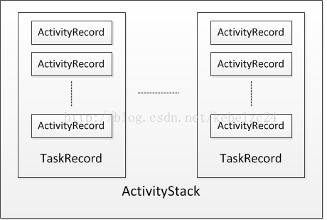
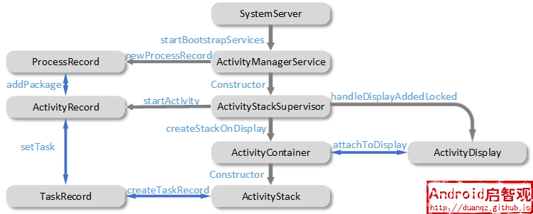
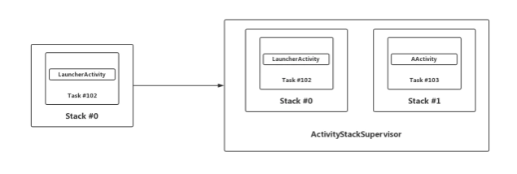
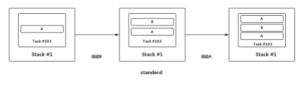
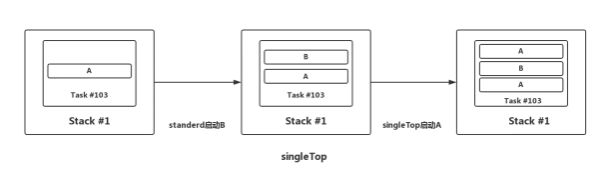
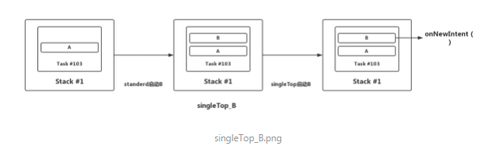
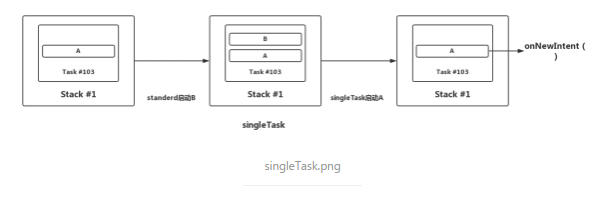
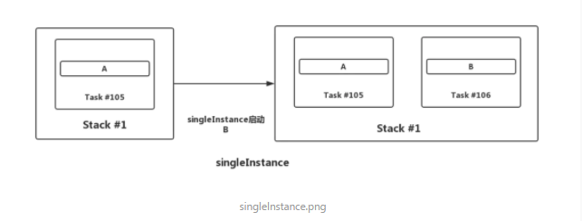

##### 1.ActivityManagerService是什么？什么时候初始化的？有什么作用？

ActivityManagerService 主要负责系统中四大组件的启动、切换、调度及应用进程的管理和调度等工作，其职责与操作系统中的进程管理和调度模块类似。

ActivityManagerService进行初始化的时机很明确，就是在SystemServer进程开启的时候，就会初始化ActivityManagerService。（系统启动流程）

如果打开一个App的话，需要AMS去通知zygote进程， 所有的Activity的生命周期AMS来控制


#####  2.ActivityThread是什么?ApplicationThread是什么?他们的区别

ActivityThread

  在Android中它就代表了Android的主线程,它是创建完新进程之后,main函数被加载，然后执行一个loop的循环使当前线程进入消息循环，并且作为主线程。

ApplicationThread

  ApplicationThread是ActivityThread的内部类， 是一个Binder对象。在此处它是作为IApplicationThread对象的server端等待client端的请求然后进行处理，最大的client就是AMS。


#####  3.Instrumentation是什么？和ActivityThread是什么关系？


 AMS与ActivityThread之间诸如Activity的创建、暂停等的交互工作实际上是由Instrumentation具体操作的。每个Activity都持有一个Instrumentation对象的一个引用， 整个进程中是只有一个Instrumentation。mInstrumentation的初始化在ActivityThread::handleBindApplication函数。

 可以用来独立地控制某个组件的生命周期。

 `Activity`的`startActivity`方法。`startActivity`会调用`mInstrumentation.execStartActivity();`

`mInstrumentation`掉用`AMS`,`AMS`通过`socket`通信告知`Zygote`进程`fork`子进程。


#####  4.ActivityManagerService和zygote进程通信是如何实现的。

应用启动时,Launcher进程请求AMS。
AMS发送创建应用进程请求，Zygote进程接受请求并fork应用进程

客户端发送请求

调用 Process.start() 方法新建进程

连接调用的是 ZygoteState.connect() 方法，ZygoteState 是 ZygoteProcess 的内部类。ZygoteState里用的LocalSocket
 ```
 public static ZygoteState connect(LocalSocketAddress address) throws IOException {
           DataInputStream zygoteInputStream = null;
           BufferedWriter zygoteWriter = null;
           final LocalSocket zygoteSocket = new LocalSocket();
            try {
               zygoteSocket.connect(address);
                zygoteInputStream = new DataInputStream(zygoteSocket.getInputStream());
                zygoteWriter = new BufferedWriter(new OutputStreamWriter(
                       zygoteSocket.getOutputStream()), 256);
           } catch (IOException ex) {
               try {
                   zygoteSocket.close();
               } catch (IOException ignore) {
               }
                throw ex;
           }
            return new ZygoteState(zygoteSocket, zygoteInputStream, zygoteWriter,
                   Arrays.asList(abiListString.split(",")));
       }
```

Zygote 处理客户端请求

Zygote 服务端接收到参数之后调用 ZygoteConnection.processOneCommand() 处理参数，并 fork 进程

最后通过 findStaticMain() 找到 ActivityThread 类的 main() 方法并执行，子进程就启动了


##### 5. ActivityRecord、TaskRecord、ActivityStack，ActivityStackSupervisor，ProcessRecord


https://duanqz.github.io/2016-02-01-Activity-Maintenance#activityrecord

https://www.jianshu.com/p/94816e52cd77

https://juejin.im/post/6856298463119409165#heading-10




  


**ActivityRecord**

Activity管理的最小单位，它对应着一个用户界面

ActivityRecord是应用层Activity组件在AMS中的代表，每一个在应用中启动的Activity，在AMS中都有一个ActivityRecord实例来与之对应，这个ActivityRecord伴随着Activity的启动而创建，也伴随着Activity的终止而销毁。


**TaskRecord**

TaskRecord即任务栈， 每一个TaskRecord都可能存在一个或多个ActivityRecord，栈顶的ActivityRecord表示当前可见的界面。

一个App是可能有多个TaskRecord存在的

一般情况下,启动App的第一个activity时，AMS为其创建一个TaskRecord任务栈

特殊情况,启动singleTask的Activity，而且为该Activity指定了和包名不同的taskAffinity， 也会为该activity创建一个新的TaskRecord


**ActivityStack**

  ActivityStack,ActivityStack是系统中用于管理TaskRecord的,内部维护了一个ArrayList<TaskRecord>。

ActivityStackSupervisor内部有两个不同的ActivityStack对象：mHomeStack、mFocusedStack，用来管理不同的任务。

我们启动的App对应的TaskRecord由非Launcher ActivityStack管理，它是在系统启动第一个app时创建的。

**ActivityStackSupervisor**

ActivityStackSupervisor管理着多个ActivityStack，但当前只会有一个获取焦点(Focused)的ActivityStack;

AMS对象只会存在一个，在初始化的时候，会创建一个唯一的ActivityStackSupervisor对象

**ProcessRecord**

ProcessRecord记录着属于一个进程的所有ActivityRecord，运行在不同TaskRecord中的ActivityRecord可能是属于同一个 ProcessRecord。

**关系**



**AMS运行在SystemServer进程中。SystemServer进程启动时，会通过SystemServer.startBootstrapServices()来创建一个AMS的对象;**

**AMS通过ActivityStackSupervisor来管理Activity。AMS对象只会存在一个，在初始化的时候，会创建一个唯一的ActivityStackSupervisor对象;**

**ActivityStackSupervisor中维护了显示设备的信息。当有新的显示设备添加时，会创建一个新的ActivityDisplay对象;**

**ActivityStack与显示设备的绑定。ActivityStack的创建时在Launcher启动时候进行的， AMS还未有非Launcher的ActivityStack。后面的App启动时就会创建Launcher的ActivityStack，**

**通过ActivityStackSupervisor来创建ActivityRecord**

**在ActivityStack上创建TaskRecord**

**每一个ActivityRecord都需要找到自己的宿主TaskRecord**


**从桌面启动**



从桌面点击图标启动一个Activity， 会启动ActivityStackSupervisor中的mFocusedStack，mFocusedStack负责管理的是非Launcher相关的任务。同时也会创建一个新的ActivityRecord和TaskRecord，ActivityRecord放到TaskRecord中，TaskRecord则放进mFocusedStack中。

**四种启动模式**

**standerd**

默认模式，每次启动Activity都会创建一个新的Activity实例。



**singleTop**

如果要启动的Activity已经在栈顶，则不会重新创建Activity，只会调用该该Activity的onNewIntent()方法。

如果要启动的Activity不在栈顶，则会重新创建该Activity的实例。






**singleTask**

如果要启动的Activity已经存在于它想要归属的栈中，那么不会创建该Activity实例，将栈中位于该Activity上的所有的Activity出栈，同时该Activity的onNewIntent()方法会被调用。





**singleInstance**

要创建在一个新栈，然后创建该Activity实例并压入新栈中，新栈中只会存在这一个Activity实例。




#####  6.ActivityManager、ActivityManagerService、ActivityManagerNative、ActivityManagerProxy的关系

https://www.cnblogs.com/mingfeng002/p/10650364.html

`Activity`的`startActivity`方法。`startActivity`会调用`mInstrumentation.execStartActivity();` `execStartActivity`通过`ActivityManager`的`getService`。


代码层面:

ActivityManager.getRunningServices里通过ActivityManagerNative.getDefault得到此代理对象ActivityManagerProxy，ActivityManagerProxy代理类是ActivityManagerNative的内部类。ActivityManagerNative是个抽象类，真正发挥作用的是它的子类ActivityManagerService。

 介绍:

ActivityManager

ActivityManager官方介绍：是与系统所有正在运行着的Acitivity进行交互，对系统所有运行中的Activity相关信息（Task，Memory，Service，App）进行管理和维护。

ActivityManagerNative、ActivityManagerProxy

IActivityManager继承了Interface接口。而ActivityManagerNative和ActivityManagerPorxy实现了这个IActivityManager接口

ActivityManagerProxy代理类是ActivityManagerNative的内部类；

ActivityManagerNative是个抽象类，真正发挥作用的是它的子类ActivityManagerService


ActivityManager持有的是这个ActivityManagerPorxy代理对象，这样，只需要操作这个代理对象就能操作其业务实现的方法。那么真正实现其也业务的则是ActivityManagerService。

 ActivityManagerNative这个类，他继承了Binder而Binder实现了IBinder接口。其子类则是ActivityManagerService。


#####  7.手写实现简化版AMS

AMS与Binder相关，其中要明白下面几个类的职责:

IBinder：跨进程通信的Base接口，它声明了跨进程通信需要实现的一系列抽象方法，实现了这个接口就说明可以进行跨进程通信，所有的Binder实体都必须实现IBinder接口。

IInterface：这也是一个Base接口，用来表示Server提供了哪些能力，是Client和Server通信的协议，Client和Server都要实现此接口。

Binder：IBinder的子类，Java层提供服务的Server进程持有一个Binder对象从而完成跨进程间通信。

BinderProxy：在Binder.java这个文件中还定义了一个BinderProxy类，这个类表示Binder代理对象它同样实现了IBinder接口。Client中拿到的实际上是这个代理对象。


1、首先定义IActivityManager接口(继承IInterface)：
```
public interface IActivityManager extends IInterface {
    //binder描述符
    String DESCRIPTOR = "android.app.IActivityManager";
    //方法编号
    int TRANSACTION_startActivity = IBinder.FIRST_CALL_TRANSACTION + 0;
    //声明一个启动activity的方法，为了简化，这里只传入intent参数
    int startActivity(Intent intent) throws RemoteException;
}
```

2、实现ActivityManagerService侧的本地Binder对象基类：
```
public abstract class ActivityManagerNative extends Binder implements IActivityManager {

    public static IActivityManager asInterface(IBinder obj) {
        if (obj == null) {
            return null;
        }
        IActivityManager in = (IActivityManager) obj.queryLocalInterface(IActivityManager.DESCRIPTOR);
        if (in != null) {
            return in;
        }
        //代理对象，见下面的代码
        return new ActivityManagerProxy(obj);
    }

    @Override
    public IBinder asBinder() {
        return this;
    }

    @Override
    protected boolean onTransact(int code, Parcel data, Parcel reply, int flags) throws RemoteException {
        switch (code) {
            // 获取binder描述符
            case INTERFACE_TRANSACTION:
                reply.writeString(IActivityManager.DESCRIPTOR);
                return true;
            // 启动activity，从data中反序列化出intent参数后，直接调用子类startActivity方法启动activity。
            case IActivityManager.TRANSACTION_startActivity:
                data.enforceInterface(IActivityManager.DESCRIPTOR);
                Intent intent = Intent.CREATOR.createFromParcel(data);
                int result = this.startActivity(intent);
                reply.writeNoException();
                reply.writeInt(result);
                return true;
        }
        return super.onTransact(code, data, reply, flags);
    }
}
```

3、实现Client侧的代理对象：

```
public class ActivityManagerProxy implements IActivityManager {
    private IBinder mRemote;

    

    @Override
    public int startActivity(Intent intent) throws RemoteException {
        Parcel data = Parcel.obtain();
        Parcel reply = Parcel.obtain();
        int result;
        try {
            // 将intent参数序列化，写入data中
            intent.writeToParcel(data, 0);
            // 调用BinderProxy对象的transact方法，交由Binder驱动处理。
            mRemote.transact(IActivityManager.TRANSACTION_startActivity, data, reply, 0);
            reply.readException();
            // 等待server执行结束后，读取执行结果
            result = reply.readInt();
        } finally {
            data.recycle();
            reply.recycle();
        }
        return result;
    }
}
```

4、实现Binder本地对象（IActivityManager接口）：

```
public class ActivityManagerService extends ActivityManagerNative {
    @Override
    public int startActivity(Intent intent) throws RemoteException {
        // 启动activity
        return 0;
    }
}
```
