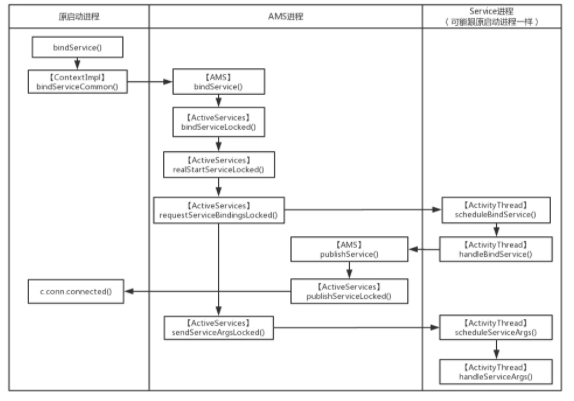
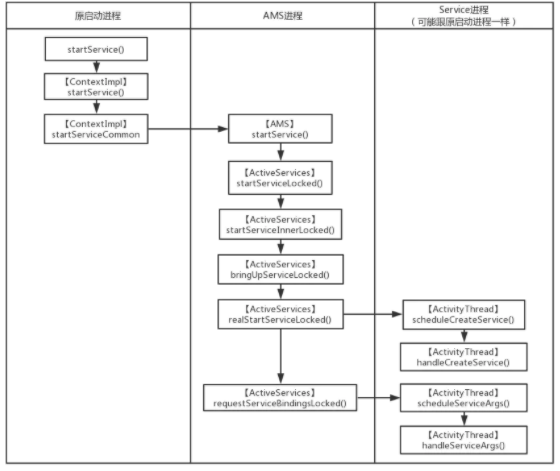

#### 1.service 的生命周期，两种启动方式的区别

**startService**

onCreate() -> onStartCommand() -> onDestroy()

**bindService**

onCreate() -> onbind() -> onUnbind()-> onDestroy()

区别

**启动**

如果服务已经开启，多次执行startService不会重复的执行onCreate()， 而是会调用onStart()和onStartCommand()。

如果服务已经开启，多次执行bindService时,onCreate和onBind方法并不会被多次调用

**销毁**

当执行stopService时，直接调用onDestroy方法

调用者调用unbindService方法或者调用者Context不存在了（如Activity被finish了），Service就会调用onUnbind->onDestroy

使用startService()方法启用服务，调用者与服务之间没有关连，即使调用者退出了，服 务仍然运行。

使用bindService()方法启用服务，调用者与服务绑定在了一起，调用者一旦退出，服务也就终止。

1、单独使用startService & stopService

（1）第一次调用startService会执行onCreate、onStartCommand。

（2）之后再多次调用startService只执行onStartCommand，不再执行onCreate。

（3）调用stopService会执行onDestroy。

2、单独使用bindService & unbindService

（1）第一次调用bindService会执行onCreate、onBind。

（2）之后再多次调用bindService不会再执行onCreate和onBind。

（3）调用unbindService会执行onUnbind、onDestroy。

#### 2.Service启动流程

http://gityuan.com/2016/03/06/start-service/

1.Process A进程采用Binder IPC向system_server进程发起startService请求；

2.system_server进程接收到请求后，向zygote进程发送创建进程的请求；

3.zygote进程fork出新的子进程Remote Service进程；

4.Remote Service进程，通过Binder IPC向sytem_server进程发起attachApplication请求；

5.system_server进程在收到请求后，进行一系列准备工作后，再通过binder IPC向remote Service进程发送scheduleCreateService请求；

6.Remote Service进程的binder线程在收到请求后，通过handler向主线程发送CREATE_SERVICE消息；

7.主线程在收到Message后，通过发射机制创建目标Service，并回调Service.onCreate()方法。

到此，服务便正式启动完成。当创建的是本地服务或者服务所属进程已创建时，则无需经过上述步骤2、3，直接创建服务即可。

**bindService**

**startService**

#### 3.Service与Activity怎么实现通信

**通过Binder对象**

1.Service中添加一个继承Binder的内部类，并添加相应的逻辑方法

2.Service中重写Service的onBind方法，返回我们刚刚定义的那个内部类实例

3.Activity中绑定服务,重写ServiceConnection，onServiceConnected时返回的IBinder（Service中的binder）调用逻辑方法

**Service通过BroadCast广播与Activity通信**

#### 4.IntentService是什么,IntentService原理，应用场景及其与Service的区别

what

IntentService 是 Service 的子类，默认开启了一个工作线程HandlerThread，使用这个工作线程逐一处理所有启动请求，在任务执行完毕后会自动停止服务。只要实现一个方法 onHandleIntent，该方法会接收每个启动请求的 Intent，能够执行后台工作和耗时操作。

可以启动 IntentService 多次，而每一个耗时操作会以队列的方式在 IntentService 的 onHandlerIntent 回调方法中执行，并且，每一次只会执行一个工作线程，执行完第一个再执行第二个。并且等待所有消息都执行完后才终止服务。

how

1.创建一个名叫 ServiceHandler 的内部 Handler

2.把内部Handler与HandlerThread所对应的子线程进行绑定

3.HandlerThread开启线程 创建自己的looper

4.通过 onStartCommand()  intent，依次插入到工作队列中，并发送给 onHandleIntent()逐个处理

可以用作后台下载任务  静默上传

why
IntentService会创建独立的worker线程来处理所有的Intent请求  Service主线程不能处理耗时操作,IntentService不会阻塞UI线程，而普通Serveice会导致ANR异常。

为Service的onBind()提供默认实现，返回null；onStartCommand提供默认实现，将请求Intent添加到队列中。

所有请求处理完成后，IntentService会自动停止，无需调用stopSelf()方法停止Service。

#### 5.Service 的 onStartCommand 方法有几种返回值?各代表什么意思?

**START_NOT_STICKY**

 在执行完 onStartCommand 后,服务被异常 kill 掉,系统不会自动重启该服务。

**START_STICKY**

重传 Intent。使用这个返回值时,如果在执行完 onStartCommand 后,服务被异 常 kill 掉,系统会自动重启该服务 ，并且onStartCommand方法会执行,onStartCommand方法中的intent值为null。

适用于媒体播放器或类似服务。

**START_REDELIVER_INTEN**

使用这个返回值时,服务被异 常 kill 掉,系统会自动重启该服务,并将 Intent 的值传入。

适用于主动执行应该立即恢复的作业（例如下载文件）的服务。

#### 6.bindService和startService混合使用的生命周期以及怎么关闭

如果你只是想要启动一个后台服务长期进行某项任务，那么使用startService便可以了。如果你还想要与正在运行的Service取得联系，那么有两种方法：一种是使用broadcast，另一种是使用bindService。

https://blog.csdn.net/u014520745/article/details/49669641

如果先startService，再bindService

onCreate()  -> onbind() -> onStartCommand()

如果先bindService，再startService

onCreate() -> onStartCommand() -> onbind()

如果只stopService

 Service的OnDestroy()方法不会立即执行,在Activity退出的时候，会执行OnDestroy。

 如果只unbindService

 只有onUnbind方法会执行，onDestory不会执行

如果要完全退出Service，那么就得执行unbindService()以及stopService。

