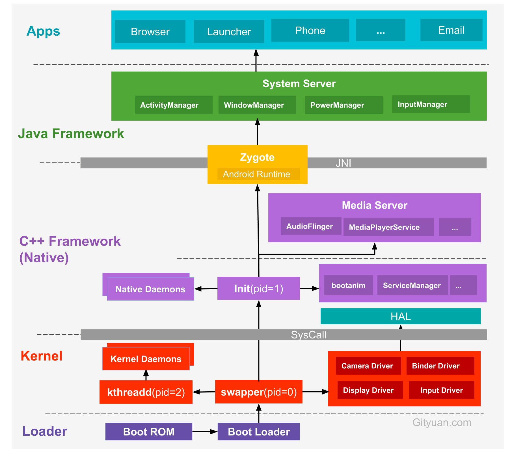

##### 1.Android系统启动流程

Android系统架分为应用层，framework层，系统运行库层（Native)，Linux内核层
启动按照一个流程：Loader->kernel->framework->Application来进行的

**1.Bootloader引导**

- 当电源按下时，引导芯片代码 从 ROM (4G)开始执行。Bootloader引导程序把操作系统映像文件拷贝到RAM中去，然后跳转到它的入口处去执行,启动Linux内核。
- `Linux kernel`内核启动,会做设置缓存,加载驱动等一些列操作
- 当内核启动完成之后,启动`init`进程,作为第一个系统进程,`init`进程从内核态转换成用户态。

**2.init进程启动**

- `fork`出`ServerManager`子进程。
  ServerManager主要用于管理我们的系统服务，他内部存在一个server服务列表，这个列表中存储的就是那些已经注册的系统服务。
- 解析`init.rc`配置文件并启动`Zygote`进程

**3.Zygote进程启动**

- 孵化其他应用程序进程，所有的应用的进程都是由zygote进程fork出来的。
  通过创建服务端Socket,等待AMS的请求来创建新的应用程序进程。
- 创建SystemServer进程,在Zygote进程启动之后,会通过ZygoteInit的main方法fork出SystemServer进程

**4.SystemServer进程启动**
- 创建SystemServiceManager，它用来对系统服务进行创建、启动和生命周期管理。
- ServerManager.startService启动各种系统服务：WMS/PMS/AMS等，调用ServerManager的addService方，将这些Service服务注册到ServerManager里面
- 启动桌面进程，这样才能让用户见到手机的界面。

**5.Launcher进程启动**

- 开启系统Launcher程序来完成系统界面的加载与显示。

##### 2.SystemServer，ServiceManager，SystemServiceManager的关系

在SystemServer进程中创建SystemServiceManager, ServiceManager是系统服务管理者,SysytemServiceManager启动一些继承自SystemService的服务，并将这些服务的Binder注册到ServiceManager中，对于其他的一些继承于IBinder的服务,通过ServiceMaanager的addService方法添加

 SystemServer：

SystemServer是一个由zygote孵化出来的进程， 名字为system_server 。
SystemServer叫做系统服务进程，大部分Android提供的一些系统服务都运行在该进程中,包括AMS，WMS，PMS，这些系统的服务都是以一个线程的方式存在在SysyemServer进程中。

 SystemServiceManager：

管理一些系统的服务，在SystemServer中初始化。启动各种系统服务：WMS/PMS/AMS等,调用ServerManager的addService方，将这些Service服务注册到ServerManager里面

 ServiceManager：

 ServiceManager像是一个路由，Service把自己注册在ServiceManager中,客户端 通过ServiceManager查询服务

 1、维护一个svclist列表来存储service信息。

 2、向客户端提供Service的代理，也就是BinderProxy。

 3、维护一个死循环，不断的查看是否有service的操作请求，如果有就读取相应的内核binder driver。

##### 3. 孵化应用进程这种事为什么不交给SystemServer来做，而专门设计一个Zygote

- Zygote进程是所有Android进程的母体，包括system_server和各个App进程。zygote利用fork()方法生成新进程，对于新进程A复用Zygote进程本身的资源，再加上新进程A相关的资源，构成新的应用进程A。应用在启动的时候需要做很多准备工作，包括启动虚拟机，加载各类系统资源等等，这些都是非常耗时的，如果能在zygote里就给这些必要的初始化工作做好，子进程在fork的时候就能直接共享，那么这样的话效率就会非常高
- SystemServer里跑了一堆系统服务，这些不能继承到应用进程

##### 4. Zygote的IPC通信机制为什么使用socket而不采用binder
- Zygote是通过fork生成进程的
- 因为fork只能拷贝当前线程，不支持多线程的fork，fork的原理是copy-on-write机制，当父子进程任一方修改内存数据时（这是on-write时机），才发生缺页中断，从而分配新的物理内存（这是copy操作）。zygote进程中已经启动了虚拟机、进行资源和类的预加载以及各种初始化操作，App进程用时拷贝即可。Zygotefork出来的进程A只有一个线程，如果Zygote有多个线程，那么A会丢失其他线程。这时可能造成死锁。
- Binder通信需要使用Binder线程池,binder维护了一个16个线程的线程池，fork()出的App进程的binder通讯没法用。

