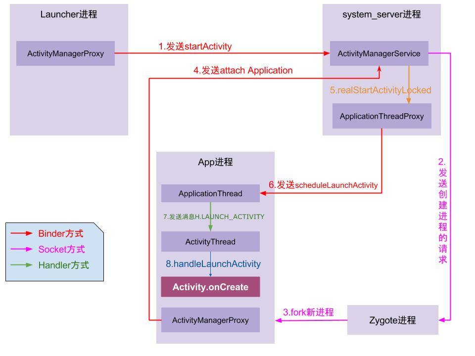
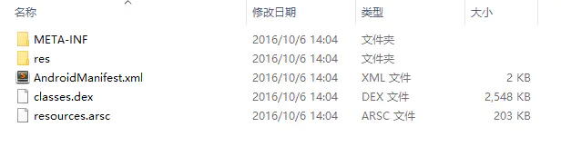
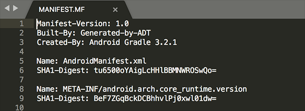
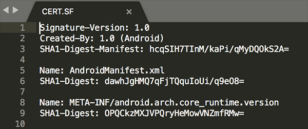
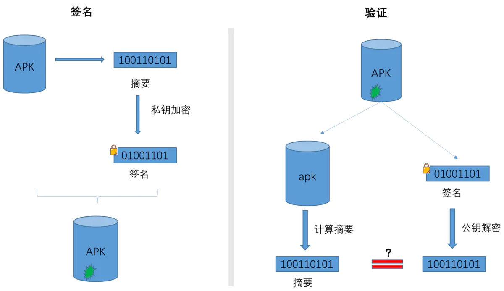
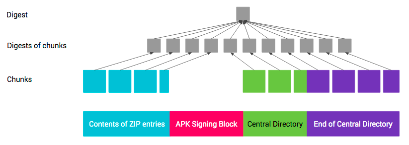
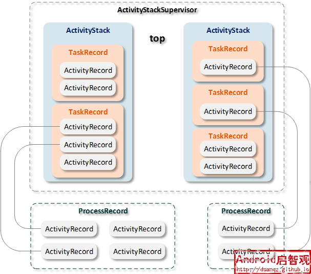

https://juejin.im/post/6844903959581163528#heading-0
#### 1.应用启动流程

**1.Launcher进程请求AMS**

点击图标发生在`Launcher`应用的进程,实际上执行的是`Launcher`的`onClick`方法，在`onClick`里面会执行到`Activity`的`startActivity`方法。`startActivity`会调用`mInstrumentation.execStartActivity();` `execStartActivity`通过`ActivityManager`的`getService`方法来得到`AMS`的代理对象(`Launcher`进程作为客户端与服务端`AMS`不在同一个进程,`ActivityManager.getService`返回的是`IActivityManager.Stub`的代理对象,此时如果要实现客户端与服务端进程间的通信， 需要`AMS`继承`IActivityManager.Stub`类并实现相应的方法,这样Launcher进程作为客户端就拥有了服务端AMS的代理对象，然后就可以调用AMS的方法来实现具体功能了)

**2. AMS发送创建应用进程请求，Zygote进程接受请求并fork应用进程**

`AMS`通过`socket`通信告知`Zygote`进程`fork`子进程。

应用进程启动`ActivityThread`,执行`ActivityThread`的`main`方法。

`main`方法中创建`ApplicationThread`，`Looper`，`Handler` 对象，并开启主线程消息循环`Looper.loop()`。

**3.App进程通过Binder向AMS(sytem_server)发起attachApplication请求,AMS绑定ApplicationThread**

 在`ActivityThread`的`main`中,通过`ApplicationThread.attach(false, startSeq)`,将`AMS`绑定`ApplicationThread`对象,这样`AMS`就可以通过这个代理对象 来控制应用进程。

**4.AMS发送启动Activity的请求**

`system_server`进程在收到请求后，进行一系列准备工作后，再通过`binder`向App进程发送`scheduleLaunchActivity`请求；`AMS`将启动`Activity`的请求发送给`ActivityThread`的`Handler`。

**5.ActivityThread的Handler处理启动Activity的请求**

`App`进程的`binder`线程（`ApplicationThread`）在收到请求后，通过`handler`向主线程发送`LAUNCH_ACTIVITY`消息； 主线程在收到`Message`后，通过发射机制创建目标`Activity`，并回调`Activity.onCreate()`等方法。 到此，`App`便正式启动，开始进入`Activity`生命周期，执行完`onCreate/onStart/onResume`方法，`UI`渲染结束后便可以看到`App`的主界面。

  

#### 2.apk组成和Android的打包流程?

resources.arsc 编译后的二进制资源文件。

classes.dex 是.dex文件。最终生成的Dalvik字节码

AndroidManifest.xml  程序的全局清单配置文件

res是uncompiled resources。存放资源文件的目录。

META-INF是签名文件夹。 存放签名信息

MANIFEST.MF（清单文件）：其中每一个资源文件都有一个SHA-256-Digest签名，MANIFEST.MF文件的SHA256（SHA1）并base64编码的结果即为CERT.SF中的SHA256-Digest-Manifest值。

CERT.SF（待签名文件）：除了开头处定义的SHA256（SHA1）-Digest-Manifest值，后面几项的值是对MANIFEST.MF文件中的每项再次SHA256并base64编码后的值。

CERT.RSA（签名结果文件）：其中包含了公钥、加密算法等信息。首先对前一步生成的MANIFEST.MF使用了SHA256（SHA1）-RSA算法，用开发者私钥签名，然后在安装时使用公钥解密。最后，将其与未加密的摘要信息（MANIFEST.MF文件）进行对比，如果相符，则表明内容没有被修改。

具体打包过程

1.aapt 打包资源文件生成 R.java 文件；aidl 生成 java 文件
2.将 java 文件编译为 class 文件
3.将工程及第三方的 class 文件转换成 dex 文件
4.将 dex 文件、so、编译过的资源、原始资源等打包成 apk 文件
5.签名
6.资源文件对齐，减少运行时内存

通过AAPT工具进行资源文件 打包，生成R.java、resources.arsc和res文件

通过AIDL工具处理AIDL文件，生成对应的Java接口文件。

通过Java Compiler编译R.java、Java接口文件、Java源文件，生成.class文件。

通过dex命令，将.class文件和第三方库中的.class文件处理生成classes.dex，该过程主要完成Java字节码转换成Dalvik字节码，压缩常量池以及清除冗余信息等工作。

通过ApkBuilder工具将资源文件、DEX文件打包生成APK文件。

通过Jarsigner工具，利用KeyStore对生成的APK文件进行签名。

assets和res/raw

 这两个文件目录里的文件都会直接在打包apk的时候直接打包到apk中，携带在应用里面供应用访问，而且不会被编译成二进制；

     他们的不同点在于：
     
     1、assets中的文件资源不会映射到R中，而res中的文件都会映射到R中，所以raw文件夹下的资源都有对应的ID;
    
     2、assets可以能有更深的目录结构，而res/raw里面只能有一层目录；
    
     3、资源存取方式不同，assets中利用AssetsManager，而res/raw直接利用getResource()，openRawResource(R.raw.fileName),很多人认为是R.id.filename,其实正确的是R.raw.filename,就像R.drawable.filename一样，整体表示一个ID值，并非是R.id.filename;

#### 3.Android的签名机制，签名如何实现的,v2相比于v1签名机制的改变

https://blog.csdn.net/freekiteyu/article/details/84849651

**签名工具**

Android 应用的签名工具有两种：jarsigner 和 signAPK。
它们的签名算法没什么区别，主要是签名使用的文件不同

jarsigner：jdk 自带的签名工具，可以对 jar 进行签名。使用 keystore 文件进行签名。生成的签名文件默认使用 keystore 的别名命名。

signAPK：Android sdk 提供的专门用于 Android 应用的签名工具。
signapk.jar是Android源码包中的一个签名工具。代码位于Android源码目录下，signapk.jar 可以编译build/tools/signapk/ 得到。
使用 pk8、x509.pem 文件进行签名。其中 pk8 是私钥文件，x509.pem 是含有公钥的文件。生成的签名文件统一使用“CERT”命名。

**jarsigner和apksigner的区别**

Android提供了两种对Apk的签名方式，一种是基于JAR的签名方式，另一种是基于Apk的签名方式，它们的主要区别在于使用的签名文件不一样：
jarsigner使用keystore文件进行签名；
apksigner除了支持使用keystore文件进行签名外，还支持直接指定pem证书文件和私钥进行签名。

**签名过程**

APK是先摘要，再签名

要了解如何实现签名，需要了解两个基本概念：数字摘要和数字证书。

**数字摘要**

就是对消息数据，通过一个Hash算法计算后，都可以得到一个固定长度的Hash值，这个值就是消息摘要。

特征：
唯一性
固定长度：比较常用的Hash算法有MD5和SHA1，MD5的长度是128拉，SHA1的长度是160位。
不可逆性

消息摘要只能保证消息的完整性，并不能保证消息的不可篡改性

**数字签名**

 在摘要的基础上再进行一次加密，对摘要加密后的数据就可以当作数字签名。利用非对称加密技术，通过私钥对摘要进行加密，产生一个字符串，如RSA就是常用的非对称加密算法。在没有私钥的前提下，非对称加密算法能确保别人无法伪造签名，因此数字签名也是对发送者信息真实性的一个有效证明。不过由于Android的keystore证书是自签名的，没有第三方权威机构认证，用户可以自行生成keystore，Android签名方案无法保证APK不被二次签名。

**签名和校验的主要过程**

选取一个签名后的 APK（Sample-release.APK）解压,在 META-INF 文件夹下有三个文件：MANIFEST.MF、CERT.SF、CERT.RSA。它们就是签名过程中生成的文件

**MANIFEST.MF**

逐一遍历 APK 中的所有条目，如果是目录就跳过，如果是一个文件，就用 SHA1（或者 SHA256）消息摘要算法提取出该文件的摘要然后进行 BASE64 编码。
分别用Name和SHA1-Digest记录

**CERT.SF**

SHA1-Digest：对 MANIFEST.MF 的各个条目做 SHA1（或者 SHA256）后再用 Base64 编码

**CERT.RSA**

之前生成的 CERT.SF 文件，用私钥计算出签名, 然后将签名以及包含公钥信息的数字证书一同写入 CERT.RSA 中保存

**签名过程：**

1、计算摘要：

通过Hash算法提取出原始数据的摘要。

2、计算签名：

再通过基于密钥（私钥）的非对称加密算法对提取出的摘要进行加密，加密后的数据就是签名信息。

3、写入签名：

将签名信息写入原始数据的签名区块内。

**校验过程：**

签名验证是发生在APK的安装过程中

1、计算摘要

首先用同样的Hash算法从接收到的数据中提取出摘要。

2、解密签名：

使用发送方的公钥对数字签名进行解密，解密出原始摘要。

3、比较摘要：

如果解密后的数据和提取的摘要一致，则校验通过；如果数据被第三方篡改过，解密后的数据和摘要将会不一致，则校验不通过。

  

**Android Apk V1 签名过程**

**Android Apk V1 校验过程**

1、解析出 CERT.RSA 文件中的证书、公钥，解密 CERT.RSA 中的加密数据。
2、解密结果和 CERT.SF 的指纹进行对比，保证 CERT.SF 没有被篡改。
3、而 CERT.SF 中的内容再和 MANIFEST.MF 指纹对比，保证 MANIFEST.MF 文件没有被篡改。
4、MANIFEST.MF 中的内容和 APK 所有文件指纹逐一对比，保证 APK 没有被篡改。

**v2相比于v1签名机制的改变**

v1 签名机制的劣势

签名校验速度慢

校验过程中需要对apk中所有文件进行摘要计算，在 APK 资源很多、性能较差的机器上签名校验会花费较长时间，导致安装速度慢。

完整性保障不够

META-INF 目录用来存放签名，自然此目录本身是不计入签名校验过程的，可以随意在这个目录中添加文件

1.V2计算加快签名速度

就是把 APK 按照 1M 大小分割，分别计算这些分段的摘要，最后把这些分段的摘要在进行计算得到最终的摘要也就是 APK 的摘要。然后将 APK 的摘要 + 数字证书 + 其他属性生成签名数据写入到 APK Signing Block 区块

2.V2保证META-INFO目录不会被篡改

v2 签名模式在原先 APK 块中增加了一个新的块（签名块），新的块存储了签名，摘要，签名算法，证书链，额外属性等信息

为了保护 APK 内容，整个 APK（ZIP文件格式）被分为以下 4 个区块：

头文件区、
V2签名块、
中央目录、
尾部。

 应用签名方案的签名信息会被保存在 区块 2（APK Signing Block）中，而区块 1（Contents of ZIP entries）、区块 3（ZIP Central Directory）、区块 4（ZIPEnd of Central Directory）是受保护的，在签名后任何对区块 1、3、4 的修改都逃不过新的应用签名方案的检查。

**数字证书**

如果数字签名和公钥一起被篡改，接收方无法得知，还是会校验通过。

如何保证公钥的可靠性呢？

 证书授权机构——CA，小明去CA机构申请证书，将小明的个人信息、公钥生成一个证书，然后把这个证书发送给jack，jack拿这个证书去证书授权机构查询，如果能匹配上小明的信息，就说明这个证书是小明的，就可以使用证书中的公钥来解密小明的消息。

接收方收到消息后，先向CA验证证书的合法性，再进行签名校验。

注意：Apk的证书通常是自签名的，也就是由开发者自己制作，没有向CA机构申请。Android在安装Apk时并没有校验证书本身的合法性，只是从证书中提取公钥和加密算法，这也正是对第三方Apk重新签名后，还能够继续在没有安装这个Apk的系统中继续安装的原因。

**keystore**

keystore文件中包含了私钥、公钥和数字证书。

**除了要指定keystore文件和密码外，也要指定alias和key的密码，这是为什么呢？**

keystore是一个密钥库，也就是说它可以存储多对密钥和证书，keystore的密码是用于保护keystore本身的，一对密钥和证书是通过alias来区分的

#### 4.APK的安装流程

复制APK到/data/app目录下，解压并扫描安装包。

资源管理器解析APK里的资源文件。

解析AndroidManifest文件，并在/data/data/目录下创建对应的应用数据目录。

然后对dex文件进行优化，并保存在dalvik-cache目录下。

将AndroidManifest文件解析出的四大组件信息注册到PackageManagerService中。

安装完成后，发送广播。

