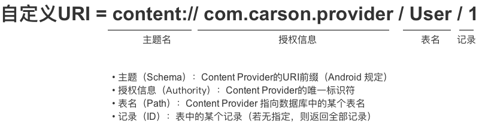

####  1.什么是ContentProvider及其使用

ContentProvider的作用是为不同的应用之间数据共享，提供统一的接口，我们知道安卓系统中应用内部的数据是对外隔离的，要想让其它应用能使用自己的数据（例如通讯录）这个时候就用到了ContentProvider。

ContentProvider（内容提供者）通过 uri 来标识其它应用要访问的数据。

通过 ContentResolver（内容解析者）的增、删、改、查方法实现对共享数据的操作。

还可以通过注册 ContentObserver（内容观察者）来监听数据是否发生了变化来对应的刷新页面

####  2.ContentProvider,ContentResolver,ContentObserver之间的关系

ContentProvider：管理数据，提供数据的增删改查操作，数据源可以是数据库、文件、XML、网络等。

ContentResolver：外部进程可以通过 ContentResolver 与 ContentProvider 进行交互。其他应用中ContentResolver 可以不同 URI 操作不同的 ContentProvider 中的数据。

ContentObserver：观察 ContentProvider 中的数据变化，并将变化通知给外界。

####  3.ContentProvider的实现原理

https://juejin.im/post/6844904062173839368#heading-0

http://gityuan.com/2016/07/30/content-provider/

https://blog.csdn.net/u011733869/article/details/83958712

**ContentProvider的安装(ActivityThread.installProvider)**

当主线程收到H.BIND_APPLICATION消息后，会调用handleBindApplication方法。

handleBindApplication->installProvider

installProvider()

创建了provider对象

创建ProviderClientRecord，这是一个provider在client进程中对应的对象

放入mProviderMap(记录所有contentProvider)

总结：把provider启动起来并记录和发布给AMS

**ContentResolver.query**

调用端App在使用ContentProvider前首先要获取ContentProvider

1。通过ContentResolver调用acquireProvider

2.ActivityThread首先通过一个map查找是否已经install过这个Provider，如果install过就直接将之返回给调用者，如果没有install过就调用AMS的getContentProvider,AMS首先查找这个Provider是否被publish过，如果publish过就直接返回，否则通过PMS找到Provider所在的App。

3.如果发现目标App进程未启动,就创建一个ContentProviderRecord对象然后调用其wait方法阻塞当前执行流程,启动目标App进程,AMS找到App的所有运行于当前进程的Provider,保存在map中,将要启动的所有Provider传给目标App进程,解除前面对获取Provider执行流程的阻塞.

4.如果目标App进程已启动，AMS在getContentProvider里会查找到要获取的Provider，就直接返回了.调用端App收到AMS的返回结果后(acquireProvider返回)，调用ActivityThread的installProvider将Provider记录到本地的一个map中，下次再调用acquireProvider就直接返回。

ContentProvider所提供的接口中只有query是基于共享内存的，其他都是直接使用binder的入参出参进行数据传递。

AMS作为一个中间管理员的身份，所有的provider会向它注册

向AMS请求到provider之后，就可以在client和server之间自行binder通信，不需要再经过systemserver

####  4.ContentProvider的优点

**封装**

采用ContentProvider方式，其 解耦了 底层数据的存储方式，使得无论底层数据存储采用何种方式，外界对数据的访问方式都是统一的，这使得访问简单 & 高效

如一开始数据存储方式 采用 SQLite 数据库，后来把数据库换成 MongoDB，也不会对上层数据ContentProvider使用代码产生影响

**提供一种跨进程数据共享的方式。**

应用程序间的数据共享还有另外的一个重要话题，就是数据更新通知机制了。因为数据是在多个应用程序中共享的，当其中一个应用程序改变了这些共享数据的时候，它有责任通知其它应用程序，让它们知道共享数据被修改了，这样它们就可以作相应的处理。

####  5.Uri 是什么

定义：Uniform Resource Identifier，即统一资源标识符

作用：唯一标识 ContentProvider & 其中的数据，URI分为 系统预置 & 自定义，分别对应系统内置的数据（如通讯录、日程表等等）和自定义数据库

每一个 ContentProvider 都拥有一个公共的 URI ，这个 URI 用于表示这个 ContentProvider 所提供的数据。

将其分为 A，B，C，D 4个部分：

A：标准前缀，；"content://"；

B：URI 的标识，用于唯一标识这个 ContentProvider ，外部调用者可以根据这个标识来找到它。

C：路径（ path ），通俗的讲就是你要操作的数据库中表的名字，

D：如果URI中包含表示需要获取的记录的 ID；则就返回该id对应的数据，如果没有 ID，就表示返回全部。