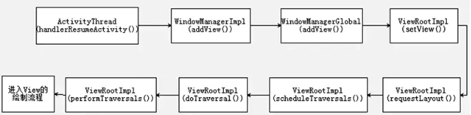
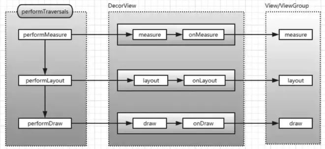
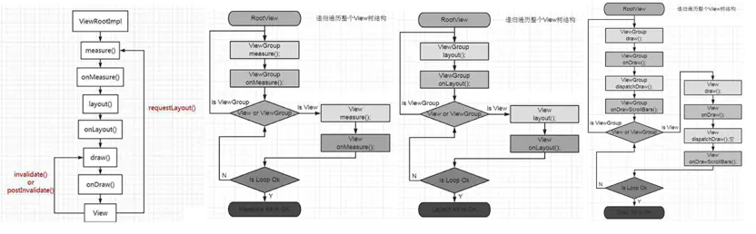
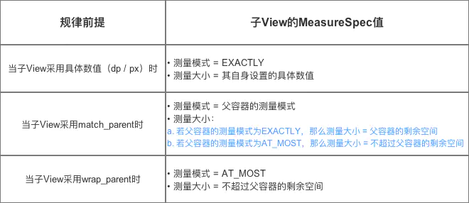
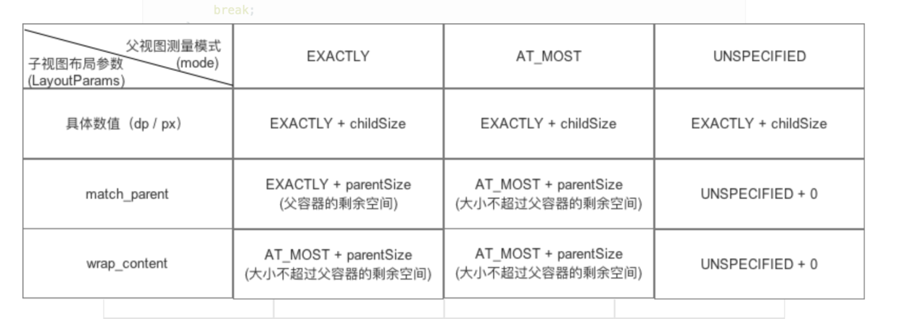
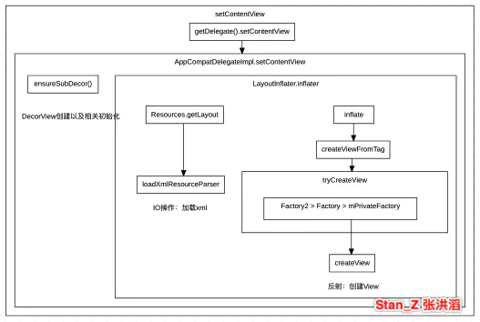

https://blog.csdn.net/songzi1228/article/details/82772052


##### 1.View绘制流程

触发addView流程：



performTraversals流程：




measure、layout、draw流程：




  startActivity->ActivityThread.handleLaunchActivity->onCreate
->完成DecorView和Activity的创建->handleResumeActivity->onResume()->DecorView添加到WindowManager->ViewRootImpl.performTraversals()方法，测量（measure）,布局（layout）,绘制（draw）, 从DecorView自上而下遍历整个View树。


Measure：测量视图宽高。  
单一View:measure() **->** onMeasure() **->** getDefaultSize() 计算View的宽/高值 **->**  setMeasuredDimension存储测量后的View宽 / 高  
ViewGroup:  
**->** measure()  
**->** 需要重写onMeasure( ViewGroup没有定义测量的具体过程，因为ViewGroup是一个抽象类，其测量过程的onMeasure方法需要各个子类去实现。如：LinearLayout、RelativeLayout、FrameLayout等等，这些控件的特性都是不一样的，测量规则自然也都不一样。)遍历测量ViewGroup中所有的View  
**->** 根据父容器的MeasureSpec和子View的LayoutParams等信息计算子View的MeasureSpec  
**->** 合并所有子View计算出ViewGroup的尺寸  
**->** setMeasuredDimension 存储测量后的宽 / 高
从顶层父View向子View的递归调用view.layout方法的过程，即父View根据上一步measure子View所得到的布局大小和布局参数，将子View放在合适的位置上。


Layout：先通过 measure 测量出 ViewGroup 宽高，ViewGroup 再通过 layout 方法根据自身宽高来确定自身位置。当 ViewGroup 的位置被确定后，就开始在 onLayout 方法中调用子元素的 layout 方法确定子元素的位置。子元素如果是 ViewGroup 的子类，又开始执行 onLayout，如此循环往复，直到所有子元素的位置都被确定，整个 View 树的 layout 过程就执行完了。


Draw：绘制视图。ViewRoot创建一个Canvas对象，然后调用OnDraw()。六个步骤：①、绘制视图的背景；②、保存画布的图层（Layer）；③、绘制View的内容；④、绘制View子视图，如果没有就不用；⑤、还原图层（Layer）；⑥、绘制View的装饰(例如滚动条等等)。

##### 2.MeasureSpec是什么
MeasureSpec表示的是一个32位的整形值，它的高2位表示测量模式SpecMode，低30位表示某种测量模式下的规格大小SpecSize。MeasureSpec是View类的一个静态内部类，用来说明应该如何测量这个View。它由三种测量模式，如下：

EXACTLY：精确测量模式，视图宽高指定为match_parent或具体数值时生效，表示父视图已经决定了子视图的精确大小，这种模式下View的测量值就是SpecSize的值。

AT_MOST：最大值测量模式，当视图的宽高指定为wrap_content时生效，此时子视图的尺寸可以是不超过父视图允许的最大尺寸的任何尺寸。

UNSPECIFIED：不指定测量模式, 父视图没有限制子视图的大小，子视图可以是想要的任何尺寸，通常用于系统内部，应用开发中很少用到。

MeasureSpec通过将SpecMode和SpecSize打包成一个int值来避免过多的对象内存分配，为了方便操作，其提供了打包和解包的方法，打包方法为makeMeasureSpec，解包方法为getMode和getSize。


##### 3.子View创建MeasureSpec创建规则是什么
根据父容器的MeasureSpec和子View的LayoutParams等信息计算子View的MeasureSpec




##### 4.自定义Viewwrap_content不起作用的原因
1.因为onMeasure()->getDefaultSize()，当View的测量模式是AT_MOST或EXACTLY时，View的大小都会被设置成子View MeasureSpec的specSize。
```
public static int getDefaultSize(int size, int measureSpec) {
     switch (specMode) {  
         case MeasureSpec.UNSPECIFIED:  
            result = size;  
            break;  
         case MeasureSpec.AT_MOST:  
        case MeasureSpec.EXACTLY:  
            result = specSize;  
            break;  
    }  
    return result;  
}  
```
2.View的MeasureSpec值是根据子View的布局参数（LayoutParams）和父容器的MeasureSpec值计算得来，具体计算逻辑封装在getChildMeasureSpec()。
当子View wrap_content或match_parent情况下，子View MeasureSpec的specSize被设置成parenSize = 父容器当前剩余空间大小  
  
3.所以当给一个View/ViewGroup设置宽高为具体数值或者match_parent，它都能正确的显示，但是如果你设置的是wrap_content->AT_MOST，则默认显示出来是其父容器的大小。如果你想要它正常的显示为wrap_content，所以需要自己重写onMeasure()来自己计算它的宽高度并设置。此时，可以在wrap_content的情况下（对应MeasureSpec.AT_MOST）指定内部宽/高(mWidth和mHeight)。

##### 5.在Activity中获取某个View的宽高有几种方法
- Activity/View#onWindowFocusChanged：此时View已经初始化完毕，当Activity的窗口得到焦点和失去焦点时均会被调用一次，如果频繁地进行onResume和onPause，那么onWindowFocusChanged也会被频繁地调用。
- view.post(runnable)： 通过post将runnable放入ViewRootImpl的RunQueue中，RunQueue中runnable最后的执行时机，是在下一个performTraversals到来的时候，也就是view完成layout之后的第一时间获取宽高。
- ViewTreeObserver#addOnGlobalLayoutListener：当View树的状态发生改变或者View树内部的View的可见性发生改变时，onGlobalLayout方法将被回调。
- View.measure(int widthMeasureSpec, int heightMeasureSpec)：
match_parent
　　直接放弃，无法measure出具体的宽/高。原因很简单，根据view的measure过程，构造此种MeasureSpec需要知道parentSize，即父容器的剩余空间，而这个时候我们无法知道parentSize的大小，所以理论上不可能测量处view的大小。

wrap_content
int widthMeasureSpec = View.MeasureSpec.makeMeasureSpec((1<<30)-1, View.MeasureSpec.AT_MOST);
int heightMeasureSpec = View.MeasureSpec.makeMeasureSpec((1<<30)-1, View.MeasureSpec.AT_MOST);
v_view1.measure(widthMeasureSpec, heightMeasureSpec);

注意到(1<<30)-1，我们知道MeasureSpec的前2位为mode，后面30位为size，所以说我们使用最大size值去匹配该最大化模式，让view自己去计算需要的大小。
这个特殊的 int 值就是 View 理论上能支持的最大值。
View 的尺寸使用 30 位二进制来表示，也就是说最大是 30 个 1（即 2^30 -1），也就是 (1<<30)-1。

具体的数值(dp/px)
　　这种模式下，只需要使用具体数值去measure即可，比如宽/高都是100px：
int widthMeasureSpec = View.MeasureSpec.makeMeasureSpec(100, View.MeasureSpec.EXACTLY);
int heightMeasureSpec = View.MeasureSpec.makeMeasureSpec(100, View.MeasureSpec.EXACTLY);
v_view1.measure(widthMeasureSpec, heightMeasureSpec);

##### 6.为什么onCreate获取不到View的宽高
Activity在执行完oncreate，onResume之后才创建ViewRootImpl,ViewRootImpl进行View的绘制工作  
调用链  
startActivity->ActivityThread.handleLaunchActivity->onCreate
->完成DecorView和Activity的创建->handleResumeActivity->onResume()->DecorView添加到WindowManager->ViewRootImpl.performTraversals()方法，测量（measure）,布局（layout）,绘制（draw）, 从DecorView自上而下遍历整个View树。

##### 7.View#post与Handler#post的区别
```
public boolean post(Runnable action) {
        final AttachInfo attachInfo = mAttachInfo;
        if (attachInfo != null) {
            return attachInfo.mHandler.post(action);
        }
        getRunQueue().post(action);
        return true;
    }  
 ```
对于View#post当View已经attach到window，直接调用UI线程的Handler发送runnable。如果View还未attach到window，将runnable放入ViewRootImpl的RunQueue中，而不是通过MessageQueue。RunQueue的作用类似于MessageQueue，只不过这里面的所有runnable最后的执行时机，是在下一个performTraversals到来的时候，也就是view完成layout之后的第一时间获取宽高，MessageQueue里的消息处理的则是下一次loop到来的时候。


##### 8.Android绘制和屏幕刷新机制原理


绘制原理

https://juejin.cn/post/6844904080989487118#heading-6

https://blog.csdn.net/freekiteyu/article/details/79483406

http://skyacer.github.io/2018/06/09/Android%E7%AA%97%E5%8F%A3%E7%AE%A1%E7%90%86%E5%88%86%E6%9E%90%EF%BC%88%E4%BA%8C%EF%BC%89%E2%80%94%E2%80%94%20WindowManagerService%E5%9B%BE%E5%B1%82%E7%AE%A1%E7%90%86%E4%B9%8B%E7%AA%97%E5%8F%A3%E7%9A%84%E6%B7%BB%E5%8A%A0/

------------------------------------------
 1.在 App 进程中创建PhoneWindow 后会创建ViewRoot。ViewRoot 的创建会创建一个 Surface壳子，请求WMS填充Surface，WMS  copyFrom() 一个 NativeSurface。

 2.响应客户端事件，创建Layer(FrameBuffer)与客户端的Surface建立连接。

 3.copyFrom()的同时创建匿名共享内存SharedClient（每一个应用和SurfaceFlinger之间都会创建一个SharedClient）

 4.当客户端 addView() 或者需要更新 View 时，App 进程的SharedBufferClient 写入数据到共享内存ShareClient中,SurfaceFlinger中的 SharedBufferServer 接收到通知会将 FrameBuffer 中的数据传输到屏幕上。

------------------------------------------
绘制的过程 CPU准备数据，通过Driver层把数据交给GPU渲染,Display负责消费显示内容

 1.CPU主要负责Measure、Layout、Record、Execute的数据计算工作

 2.GPU负责Rasterization（栅格化(向量图形的格式表示的图像转换成位图用于显示器)）、渲染,渲染好后放到buffer(图像缓冲区)里存起来.

 3.Display（屏幕或显示器）屏幕会以一定的帧率刷新，每次刷新的时候，就会从缓存区将图像数据读取显示出来,如果缓存区没有新的数据，就一直用旧的数据，这样屏幕看起来就没有变

------------------------------------------

刷新机制（https://juejin.cn/post/6863756420380196877#heading-11）

双缓存

    屏幕刷新频是固定的,每16.6ms从buffer取数据显示完一帧,理想情况是帧率（GPU 在一秒内绘制操作的帧数，单位 fps）和刷新频率保持一致，即每绘制完成一帧，显示器显示一帧,但是CPU/GPU写数据是不可控,所以会出现buffer里有些数据根本没显示出来就被重写了导致buffer抓取的帧并不是完整的一帧画面，即出现画面撕裂。

  由于图像绘制和屏幕读取 使用的是同个buffer，所以屏幕刷新时可能读取到的是不完整的一帧画面。所以引入双缓存

  让绘制和显示器拥有各自的buffer：GPU 始终将完成的一帧图像数据写入到 Back Buffer，而显示器使用 Frame Buffer，当屏幕刷新时，Frame Buffer 并不会发生变化，当Back buffer准备就绪后，它们才进行交换。

什么时候进行交换 引入VSync

VSync（解决画面撕裂）

如果 Back buffer准备完成一帧数据以后就进行交换,时屏幕还没有完整显示上一帧内容的话，肯定是会出问题

如果 Frame buffer处理完一帧数据以后进行交换，可以。

 vsync垂直同步利用 垂直同步脉冲（当扫描完一个屏幕后，设备需要重新回到第一行以进入下一次的循环，，此时屏幕没有在刷新，有一段时间空隙，这个时间点就是我们进行缓冲区交换的最佳时间。）  保证双缓冲在最佳时间点才进行交换。


-------------------------------------


在Android4.1之前，屏幕刷新也遵循 上面介绍的 双缓存+VSync 机制


 第2帧的CPU/GPU计算 没能在VSync信号到来前完成，屏幕平白无故地多显示了一次第1帧。

 解决方式如果 Vsyn到来时 CPU/GPU就开始操作的话，是有完整的16.6ms的，这样应该会基本避免jank的出现了


-------------------------------------


为了优化显示性能，Google在Android 4.1系统中对Android Display系统进行了重构，实现了Project Butter（黄油工程）

  **1.drawing with VSync**

    一旦收到VSync通知（16ms触发一次），CPU和GPU 才立刻开始计算然后把数据写入buffer，可以让CPU/GPU有完整的16ms时间来处理数据，减少了jank。

 **2.三缓存**


如果界面比较复杂，CPU/GPU的处理时间较长 超过了16.6ms,
Back buffer正在被GPU用来处理B帧的数据， Frame buffer的内容用于Display的显示，这样两个buffer都被占用，CPU 则无法准备下一帧的数据,在Jank的阶段空空等待，存在CPU资源浪费。

三缓存就是在双缓冲机制基础上增加了一个 Graphic Buffer 缓冲区，这样可以最大限度的利用空闲时间，带来的坏处是多使用的一个 Graphic Buffer 所占用的内存。

让多增加一个Buffer给CPU用，让它提前忙起来，这样就能做到三方都有Buffer可用，CPU跟GPU不用争一个Buffer，真正实现并行处理

三缓冲有效利用了等待vysnc的时间，减少了jank，保证画面的连续性，提高柔韧性

 **3.Choreographer**

Choreographer， 编舞者。 指 对CPU/GPU绘制的指导，收到VSync信号 才开始绘制，保证绘制拥有完整的16.6ms，避免绘制的随机性。控制只在vsync信号来时触发重绘呢


比如说绘制可能随时发起，封装一个Runnable丢给Choreography，下一个vsync信号来的时候，开始处理消息，然后真正的开始界面的重绘了。相当于UI绘制的节奏完全由Choreography来控制。


应用程序调用requestLayout发起重绘，通过Choreographer发送异步消息，请求同步vsync信号，即下一次vsync信号过来时，系统服务SurfaceFlinger在第一时间通知我们，触发UI绘制。虽然可以手动多次调用，但是在一个vsync周期内，requestLayout只会执行一次。


##### 9.Choreography原理
绘制是由应用端(任何时候都有可能)发起的，如果屏幕收到vsync信号，但是这一帧的还没有绘制完，就会显示上一帧的数据，这并不是因为绘制这一帧的时间过长(超过了信号发送周期)，只是信号快来的时候才开始绘制，如果频繁的出现的这种情况。
一般调用requestLayout触发，这个函数随时都能调用，为了只控制在vsync信号来时触发重绘引入Choreography。
ViewRoot.doTravle()->mChoreographer.postCallback  
Choreographer对外提供了postCallback等方法，最终他们内部都是通过调用postCallbackDelayedInternal（）实现这个方法主要会做两件事情
1存储Action
请求垂直同步，垂直同步
2垂直同步回调立马执行Action（CallBack/Runnable）。


##### 10.什么是双缓冲
通俗来讲就是有两个缓冲区，一个后台缓冲区和一个前台缓冲区，每次后台缓冲区接受数据，当填充完整后交换给前台缓冲，这样就保证了前台缓冲里的数据都是完整的。
Surface 对应了一块屏幕缓冲区，是要显示到屏幕的内容的载体。每一个 Window 都对应了一个自己的 Surface 。这里说的 window 包括 Dialog, Activity, Status Bar 等。SurfaceFlinger 最终会把这些 Surface 在 z 轴方向上以正确的方式绘制出来（比如 Dialog 在 Activity 之上）。SurfaceView 的每个 Surface 都包含两个缓冲区，而其他普通 Window 的对应的 Surface 则不是。

##### 11.为什么使用SurfaceView
我们知道View是通过刷新来重绘视图，系统通过发出VSSYNC信号来进行屏幕的重绘，刷新的时间间隔是16ms,如果我们可以在16ms以内将绘制工作完成，则没有任何问题，如果我们绘制过程逻辑很复杂，并且我们的界面更新还非常频繁，这时候就会造成界面的卡顿，影响用户体验，为此Android提供了SurfaceView来解决这一问题。他们的UI不适合在主线程中绘制。对一些游戏画面，或者摄像头，视频播放等，UI都比较复杂，要求能够进行高效的绘制，因此，他们的UI不适合在主线程中绘制。这时候就必须要给那些需要复杂而高效的UI视图生成一个独立的绘制表面Surface,并且使用独立的线程来绘制这些视图UI。

##### 12.什么是SurfaceView
SurfaceView是View的子类，且实现了Parcelable接口且实现了Parcelable接口，其中内嵌了一个专门用于绘制的Surface，SurfaceView可以控制这个Surface的格式和尺寸，以及Surface的绘制位置。可以理解为Surface就是管理数据的地方，SurfaceView就是展示数据的地方。使用双缓冲机制，有自己的 surface，在一个独立的线程里绘制。
SurfaceView虽然具有独立的绘图表面，不过它仍然是宿主窗口的视图结构中的一个结点，因此，它仍然是可以参与到宿主窗口的绘制流程中去的。从SurfaceView类的成员函数draw和dispatchDraw的实现就可以看出，SurfaceView在其宿主窗口的绘图表面上面所做的操作就是将自己所占据的区域绘为黑色，除此之外，就没有其它更多的操作了，这是因为SurfaceView的UI是要展现在它自己的绘图表面上面的。
优点： 使用双缓冲机制，可以在一个独立的线程中进行绘制，不会影响主线程，播放视频时画面更流畅
缺点：Surface不在View hierachy中，它的显示也不受View的属性控制，SurfaceView 不能嵌套使用。在7.0版本之前不能进行平移，缩放等变换，也不能放在其它ViewGroup中，在7.0版本之后可以进行平移，缩放等变换。

##### 13.View和SurfaceView的区别
 View适用于主动更新的情况，而SurfaceView则适用于被动更新的情况，比如频繁刷新界面。
 View在主线程中对页面进行刷新，而SurfaceView则开启一个子线程来对页面进行刷新。
 View在绘图时没有实现双缓冲机制，SurfaceView在底层机制中就实现了双缓冲机制。

##### 14.SurfaceView为什么可以直接子线程绘制
 通常View更新的时候都会调用ViewRootImpl中的performXXX()方法，在该方法中会首先使用checkThread()检查是否当前更新位于主线线程，SurfaceView提供了专门用于绘制的Surface，可以通过SurfaceView来控制Surface的格式和尺寸，SurfaceView更新就不需要考虑线程的问题，它既可以在子线程更新，也可以在主线程更新。


##### 15.SurfaceView、TextureView、SurfaceTexture、GLSurfaceView
https://zhooker.github.io/2018/03/24/SurfaceTexture%E7%9A%84%E5%8C%BA%E5%88%AB/  
SurfaceView：使用双缓冲机制，有自己的 surface，在一个独立的线程里绘制，Android7.0之前不能平移、缩放
TextureView：它不会在WMS中单独创建窗口，而是作为一个普通View，可以和其它普通View一样进行移动，旋转，缩放，动画等变化。值得注意的是TextureView必须在硬件加速的窗口中。  
SurfaceTexture：SurfaceTexture和SurfaceView不同的是，它对图像流的处理并不直接显示，而是转为OpenGL外部纹理，因此可用于图像流数据的二次处理（如Camera滤镜，桌面特效等）。
GLSurfaceView：SurfaceView不同的是，它加入了EGL的管理，并自带了渲染线程。


##### 16.getWidth()方法和getMeasureWidth()区别
①getMeasuredWidth方法获得的值是setMeasuredDimension方法设置的值，它的值在measure方法运行后就会确定

②getWidth方法获得是layout方法中传递的四个参数中的mRight-mLeft，它的值是在layout方法运行后确定的

③一般情况下在onLayout方法中使用getMeasuredWidth方法，而在除onLayout方法之外的地方用getWidth方法。


##### 17.invalidate() 和 postInvalidate() 方法的区别
requestLayout：会触发三大流程。
invalidate：触发 onDraw 流程，在 UI 线程调用。
postInvalidate：触发 onDraw 流程，在非 UI 线程中调用。

1. view的invalidate递归调用父view的invalidateChildInParent，直到ViewRootImpl的invalidateChildInParent，然后触发peformTraversals，会导致当前view被重绘,由于mLayoutRequested为false，不会导致onMeasure和onLayout被调用，而OnDraw会被调用
2. postInvalidate(),它可以在UI线程调用，也可以在子线程中调用， postInvalidate()方法内部通过Handler发送了一个消息将线程切回到UI线程通知重新绘制 。最终还是调用了子View的invalidate()


##### 18.Requestlayout，onlayout，onDraw，DrawChild区别与联系
requestLayout()方法 ：会导致调用 measure()过程 和 layout()过程,不一定会触发OnDraw。
 requestLayout会直接递归调用父窗口的requestLayout，直到ViewRootImpl,然后触发peformTraversals，由于mLayoutRequested为true，会导致onMeasure和onLayout被调用。不一定会触发OnDraw， 将会根据标志位判断是否需要ondraw。
onLayout()方法(如果该View是ViewGroup对象，需要实现该方法，对每个子视图进行布局)
onDraw()方法：绘制视图本身 (每个View都需要重载该方法，ViewGroup不需要实现该方法)。
drawChild()：去重新回调每个子视图的draw()方法。


##### 19.LinearLayout、FrameLayout 和 RelativeLayout 哪个效率高
简单布局  FrameLayout>LinearLayout>RelativeLayout
复杂布局  RelativeLayout>LinearLayout>FrameLayout
（1）Fragment是从上到下的一个堆叠的方式布局的，那当然是绘制速度最快，只需要将本身绘制出来即可，但是由于它的绘制方式导致在复杂场景中直接是不能使用的，所以工作效率来说Fragment仅使用于单一场景  
（2）RelativeLayout会让子View调用2次onMeasure，LinearLayout 在有weight时，也会调用子View 2次onMeasure。 由于RelativeLayout需要在横向和纵向分别进行一次measure过程。而LinearLayout只进行纵向或横向的测量，所以measure的时间会比RelativeLayout少很多。但是如果设置了 weight,在测量的过程中，LinearLayout会将设置过weight的和没设置的分别测量一次，这样就导致measure两次。
（3）在不影响层级深度的情况下,使用LinearLayout和FrameLayout而不是RelativeLayout，复杂布局使用RelativeLayout  
简单布局:在DecorView自己是FrameLayout但是它只有一个子元素是属于LinearLayout。因为DecorView的层级深度是已知而且固定的，上面一个标题栏，下面一个内容栏。采用RelativeLayout并不会降低层级深度，所以此时在根节点上用LinearLayout是效率最高的。  
 复杂布局:RelativeLayout 在性能上更好，使用 LinearLayout 容易产生多层嵌套的布局结构，这在性能上是不好的。 而 RelativeLayout 通常层级结构都比较扁平，很多使用LinearLayout 的情况都可以用一个 RelativeLayout 来替代，以降低布局的嵌套层级，优化性能。


##### 20.LinearLayout的绘制流程
onMeasure():1>：把 ViewRootImpl 的测量模式 传递给 DecorView，然后 DecorView 把测量模式 传递给 LinearLayout，遍历子元素并对每个子元素执行measureChildBeforeLayout方法，这个方法内部会调用子元素的measure方法，这样各个子元素就开始依次进入measure过程。
2.LinearLayout类的measureVertical方法会遍历每一个子元素并且执行LinearLayout类的measureChildBeforeLayout方法对子元素进行测量，LinearLayout类的measureChildBeforeLayout方法内部会执行子元素的measure方法。在代码中，变量mTotalLength会是用来存放LinearLayout在竖直方向上的当前高度，每遍历一个子元素，mTotalLength就会增加
onLayout(): onLayout():
其中会遍历调用每个子View的setChildFrame方法为子元素确定对应的位置
其中会遍历调用每个子View的setChildFrame方法为子元素确定对应的位置。其中的childTop会逐渐增大，意味着后面的子元素会被放置在靠下的位置。


#####  21.自定义 View 的流程和注意事项
大多数自定义View要么是在onDraw方法中画点东西，和在onTouchEvent中处理触摸事件。  
自定义View步骤  ：
onMeasure，可以不重写，不重写的话就要在外面指定宽高，建议重写；
onDraw，看情况重写，如果需要画东西就要重写；
onTouchEvent，也是看情况，如果要做能跟手指交互的View，就重写；
自定义View注意事项：  
如果有自定义布局属性的，在构造方法中取得属性后应及时调用recycle方法回收资源；  
onDraw和onTouchEvent方法中都应尽量避免创建对象，过多操作可能会造成卡顿；  

自定义ViewGroup步骤：  
onMeasure（必须），在这里测量每一个子View，还有处理自己的尺寸；  
onLayout（必须），在这里对子View进行布局；  
如有自己的触摸事件，需要重写onInterceptTouchEvent或onTouchEvent;  
自定义ViewGroup注意事项：  
如果想在ViewGroup中画点东西，又没有在布局中设置background的话，会画不出来，这时候需要调用setWillNotDraw方法，并设置为false；  
如果有自定义布局属性的，在构造方法中取得属性后应及时调用recycle方法回收资源；  
onDraw和onTouchEvent方法中都应尽量避免创建对象，过多操作可能会造成卡顿；

#####  22.自定义View如何考虑机型适配
合理使用warp_content，match_parent。
尽可能地使用RelativeLayout。  
针对不同的机型，使用不同的布局文件放在对应的目录下，android会自动匹配。  
尽量使用点9图片。  
使用与密度无关的像素单位dp，sp。  
引入android的百分比布局。  
切图的时候切大分辨率的图，应用到布局当中，在小分辨率的手机上也会有很好的显示效果。

#####  23.自定义控件优化方案
1.降低View.onDraw（）的复杂度
onDraw不要创建新的局部对象
onDraw不执行耗时操作
2.避免过度绘制（Overdraw）
过度绘制 会导致屏幕显示的色块不同，
尽可能避免 过度绘制的粉色 & 红色情况
移除默认的 Window 背景
<item name="android:windowBackground">@null</item>
若不移除，则导致所有界面都多 1 次绘制
移除 控件中不必要的背景
对于1个ViewPager + 多个 Fragment 组成的首页界面，若每个
Fragment 都设有背景色，即 ViewPager 则无必要设置，可移除
减少布局文件的层级（嵌套）
减少不必要的嵌套 ->> UI层级少 ->> 过度绘制的可能性低
自定义控件View优化：使用 clipRect() 、 quickReject()
 给 Canvas 设置一个裁剪区域，只有在该区域内才会被绘制，区域之外的都不绘制


##### 24.invalidate怎么局部刷新


##### 25.View加载流程（setContentView）




1.DecorView初始化

2.通过LayoutInflate对象去加载View，主要步骤是

（1）通过xml的Pull方式去解析xml布局文件，获取xml信息，并保存缓存信息.

（2）根据xml的tag标签通过反射创建View逐层构建View

（3）递归构建其中的子View，并将子View添加到父ViewGroup中


