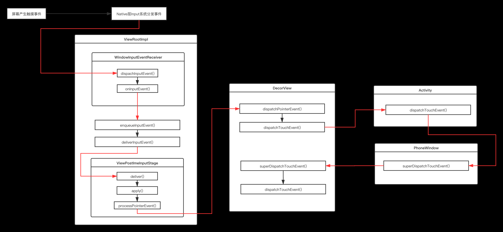

#####  1.View事件分发机制

https://www.jianshu.com/p/e99b5e8bd67b

三个角色  
1、Activity：只有分发dispatchTouchEvent和消费onTouchEvent两个方法。  事件由ViewRootImpl中DecorView
dispatchTouchEvent分发Touch事件->Activity的dispatchTouchEvent()-
DecorView。superDispatchTouchEvent-> ViewGroup的dispatchTouchEvent()。
如果返回false直接掉用onTouchEvent，true表示被消费

2、ViewGroup：拥有分发、拦截和消费三个方法。：对应一个根ViewGroup来说，点击事件产生后，首先会传递给它，dispatchTouchEvent就会被调用，如果这个ViewGroup的onInterceptTouchEvent方法返回true就表示它要拦截当前事件， 事件就会交给这个ViewGroup的onTouchEvent处理。如果这个ViewGroup的onInterceptTouchEvent方法返回false就表示它不拦截当前事件，这时当前事件就会继续传递给它的子元素，接着子元素的dispatchTouchEvent方法就会被调用。

3、View：只有分发和消费两个方法。方法返回值为true表示当前视图可以处理对应的事件；返回值为false表示当前视图不处理这个事件，会被传递给父视图的

三个核心事件

1、dispatchTouchEvent()：方法返回值为true表示事件被当前视图消费掉； 返回为false表示 停止往子View传递和分发,交给父类的onTouchEvent处理

2、onInterceptTouchEvent() ： return false 表示不拦截，需要继续传递给子视图。return true 拦截这个事件并交由自身的onTouchEvent方法进行消费.

3、 onTouchEvent() ： return false 是不消费事件，会被传递给父视图的onTouchEvent方法进行处理。return true 是消费事件。

##### 2.view的onTouchEvent，OnClickListerner和OnTouchListener的onTouch方法 三者优先级

 dispatchTouchEvent->onTouch->onInterceptTouchEvent->onTouchEvent。  
1.dispatchTouchEvent中限制性mOnTouchListener.onTouch()  onTouchListener的onTouch方法优先级比onTouchEvent高，会先触发。
2.假如onTouch方法返回false会接着触发onTouchEvent，返回true,onTouchEvent方法不会被调用。
3.onClick事件是在onTouchEvent的MotionEvent.ACTION_UP事件通过performClick() 触发的。 OnTouchListener中onTouch方法如果返回true，则不会执行view的onTouchEvent方法，也就更不会执行view的onClickListener的onClick方法,返回false，则两个都会执行。

##### 3.onTouch 和onTouchEvent 的区别
onTouch方法是View的 OnTouchListener借口中定义的方法。
当一个View绑定了OnTouchLister后，当有touch事件触发时，就会调用onTouch方
onTouchEvent  处理点击事件在dispatchTouchEvent中掉用

 onTouchListener的onTouch方法优先级比onTouchEvent高，会先触发。
 假如onTouch方法返回false，会接着触发onTouchEvent，反之onTouchEvent方法不会被调用。
 内置诸如click事件的实现等等都基于onTouchEvent，假如onTouch返回true，这些事件将不会被触发

##### 4.ACTION_CANCEL什么时候触发
1.如果在父View中拦截ACTION_UP或ACTION_MOVE，在第一次父视图拦截消息的瞬间，父视图指定子视图不接受后续消息了，同时子视图会收到ACTION_CANCEL事件。  
2.如果触摸某个控件，但是又不是在这个控件的区域上抬起（移动到别的地方了），就会出现action_cancel。

##### 5.事件是先到DecorView还是先到Window
DecorView -> Activity -> PhoneWindow -> DecorView  
当屏幕被触摸input系统事件从Native层分发Framework层的InputEventReceiver.dispachInputEvent()调用了ViewRootImpl.WindowInputEventReceiver.dispachInputEvent()->ViewRootImpl中的DecorView.dispachInputEvent()->Activity.dispachInputEvent()->window.superDispatchTouchEvent()->DecorView.superDispatchTouchEvent()->Viewgroup.superDispatchTouchEvent()
 

#####  6.点击事件被拦截，但是想传到下面的View，如何操作
重写子类的requestDisallowInterceptTouchEvent()方法返回true就不会执行父类的onInterceptTouchEvent()， 可将点击事件传到下面的View, 剥夺了父view 对除了ACTION_DOWN以外的事件的处理权。

#####  7.如何解决View的事件冲突

常见开发中事件冲突的有ScrollView与RecyclerView的滑动冲突、RecyclerView内嵌同时滑动同一方向

滑动冲突的实现方法：

外部拦截法：指点击事件都先经过父容器的拦截处理，如果父容器需要此事件就拦截，否则就不拦截。具体方法：需要重写父容器的onInterceptTouchEvent方法，在内部做出相应的拦截。
内部拦截法：指父容器不拦截任何事件，而将所有的事件都传递给子容器，如果子容器需要此事件就直接消耗，否则就交由父容器进行处理。具体方法：需要配合requestDisallowInterceptTouchEvent方法。

https://www.jianshu.com/p/982a83271327

外部拦截法：

父View在ACTION_MOVE中开始拦截事件，那么后续ACTION_UP也将默认交给父View处理！

内部拦截法：

即父View不拦截任何事件，所有事件都传递给子View，子View根据需要决定是自己消费事件还是给父View处理

如果父容器需要获取点击事件则调用 parent.requestDisallowInterceptTouchEvent(false)方法，让父容器去拦截事件

##### 8.在 ViewGroup 中的 onTouchEvent 中消费 ACTION_DOWN 事件，ACTION_UP事件是怎么传递

一个事件序列只能被一个View拦截且消耗。因为一旦一个元素拦截了此事件，那么同一个事件序列内的所有事件都会直接交给它处理（即不会再调用这个View的拦截方法去询问它是否要拦截了，而是把剩余的ACTION_MOVE、ACTION_DOWN等事件直接交给它来处理）。

Activity.dispatchTouchEvent() -> ViewGroup1.dispatchTouchEvent() -> ViewGroup1.onInterceptTouchEvent() -> view1.dispatchTouchEvent() -> view1.onTouchEvent() -> ViewGroup1.onTouchEvent()

-> Activity.dispatchTouchEvent()
-> ViewGroup1.dispatchTouchEvent()
-> ViewGroup1.onTouchEvent()

##### 9.Activity ViewGroup和View都不消费ACTION_DOWN,那么ACTION_UP事件是怎么传递的

ACTION_DOWN:-> Activity.dispatchTouchEvent() -> ViewGroup1.dispatchTouchEvent() -> ViewGroup1.onInterceptTouchEvent() -> view1.dispatchTouchEvent() -> view1.onTouchEvent() -> ViewGroup1.onTouchEvent() -> Activity.onTouchEvent();

ACTION_MOVE > Activity.dispatchTouchEvent()
-> Activity.onTouchEvent();
-> 消费

#####  10.同时对父 View 和子 View 设置点击方法，优先响应哪个
 优先响应子 view， ，如果先响应父 view，那么子 view 将永远无法响应，父 view 要优先响应事件，必须先调用 onInterceptTouchEvent 对事件进行拦截，那么事件不会再往下传递，直接交给父 view 的 onTouchEvent 处理。

#####  11.requestDisallowInterceptTouchEvent的调用时机

事件分发列子

https://blog.csdn.net/lmj623565791/article/details/39102591

