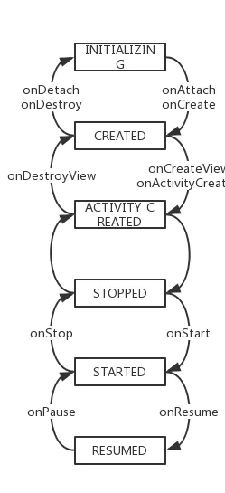

####  1.Fragment的生命周期 & 结合Activity的生命周期

https://juejin.cn/post/6844903752114126855#heading-0

#### 2.Activity和Fragment的通信方式， Fragment之间如何进行通信

Activity和Fragment

1.采用Bundle的方式
在activity中建一个bundle，把要传的值存入bundle，然后通过fragment的setArguments（bundle）传到fragment，在fragment中，用getArguments接收。

2.采用接口回调的方式

3.EventBus的方式

4.viewModel 做数据管理，activity 和 fragment 公用同个viewModel 实现数据传递

Fragment之间

1.EventBus的方式

2.采用接口回调的方式

3.Fragment 通过 getActivity 获取到Activity，Activity通过findFragmentByTag||findFragmentById获取Fragment,Fragment 实现接口.

#### 3.为什么使用Fragment.setArguments(Bundle)传递参数

https://www.jianshu.com/p/c06efe090589

Activity.onCreate(Bundle saveInstance)->Fragment.instantitate()

当再次重建时会通过空参构造方法反射出新的fragment。并且给mArgments初始化为原先的值，而原来的Fragment实例的数据都丢失了。

Activity重新创建时，会重新构建它所管理的Fragment，原先的Fragment的字段值将会全部丢失，但是通过Fragment.setArguments(Bundle bundle)方法设置的bundle会保留下来，并在重建时恢复。所以，尽量使用Fragment.setArguments(Bundle bundle)方式来进行参数传递。

#### 4.FragmentPageAdapter和FragmentStatePageAdapter区别及使用场景

使用FragmentPagerAdapter时    页面切换，只是调用detach，而不是remove，所以只执行onDestroyView，而不是onDestroy，不会摧毁Fragment实例，只会摧毁Fragment 的View；

 使用FragmentStatePageAdapter时    页面切换，调用remove，执行onDestroy。直接摧毁Fragment。

 FragmentPagerAdapter最好用在少数静态Fragments的场景，用户访问过的Fragment都会缓存在内存中，即使其视图层次不可见而被释放(onDestroyView) 。因为Fragment可能保存大量状态，因此这可能会导致使用大量内存。

 页面很多时，可以考虑FragmentStatePagerAdapter

#### 5.fragment懒加载

判断当前 Fragment 是否对用户可见，只是 onHiddenChanged() 是在 add+show+hide 模式下使用，  setUserVisibleHint 是在 ViewPager+Fragment 模式下使用。

https://juejin.cn/post/6844904050698223624#heading-0

https://www.jianshu.com/p/bef74a4b6d5e

**老的懒加载处理方案**

对 ViewPager 中的 Fragment 懒加载

方法1： 继承模式

通过继承懒加载Fragment基类，在setUserVisibleHint中判断可见并且 当onViewCreated()表明View已经加载完毕后再掉用加载方法。

方法2:代理+反射模式

1.adapter中getitem时new一个代理fragment

2.setUserVisibleHint中根据反射得到真正的fragement

3.通过add commit把真正的fragement添加到代理fragment中

方法1：不可见的 Fragment 执行了 onResume() 方法。因为setUserVisibleHint位于onCreateView之前,此时为false，onResume之后为true，在true后加载相当于onResume()等方法在真实的createView之前调用，不可见的 Fragment 执行了 onResume() 方法。

**Androidx 下的懒加载**

在 FragmentPagerAdapter 与 FragmentStatePagerAdapter 新增了含有 behavior 字段的构造函数

如果 behavior 的值为 BEHAVIOR_RESUME_ONLY_CURRENT_FRAGMENT ，那么当前选中的 Fragment 在 Lifecycle.State#RESUMED 状态 ，其他不可见的 Fragment 会被限制在 Lifecycle.State#STARTED 状态

原因:FragmentPagerAdapter 在其 setPrimaryItem 方法中调用了 setMaxLifecycle,
所以说onResume中执行懒加载

#### 6.ViewPager2与ViewPager区别

https://juejin.cn/post/6844904020553760782#heading-0

1. FragmentStateAdapter 替代FragmentStatePagerAdapter，PagerAdapter被RecyclerView.Adapter替代
2. 支持竖直滑动，禁止滑动
3. PageTransformer用来设置页面动画，设置页面间距
4. 预加载当setOffscreenPageLimit被设置为OFFSCREEN_PAGE_LIMIT_DEFAULT时候会使用RecyclerView的缓存机制。

#### 7.fragment嵌套问题
