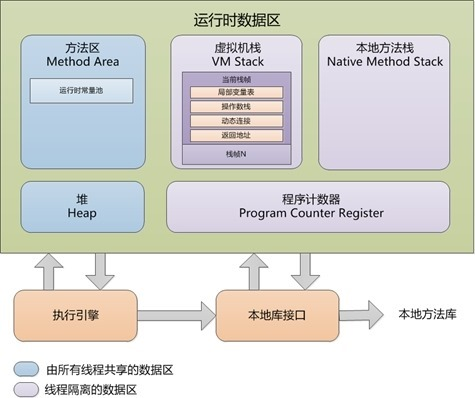
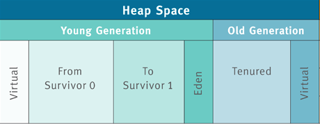
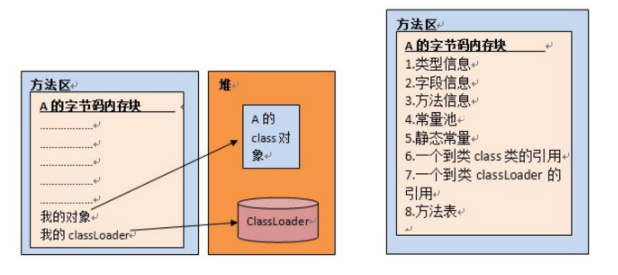
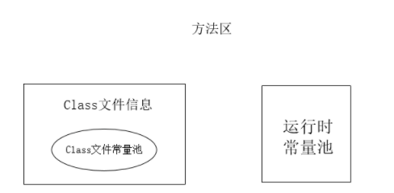
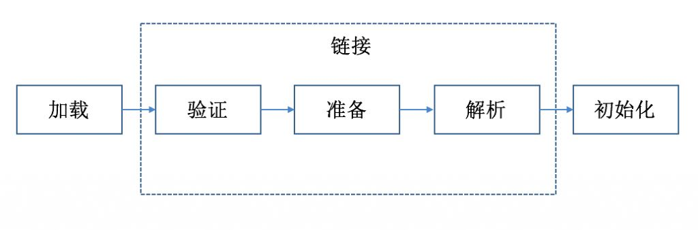
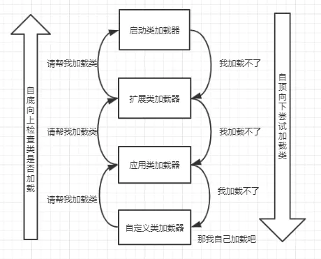
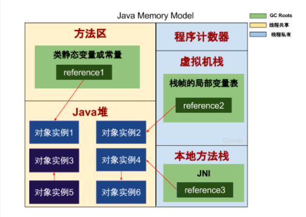

##### 1.什么是虚拟机

 Java 虚拟机是一个字节码翻译器，它将字节码文件翻译成各个系统对应的机器码，确保字节码文件能在各个系统正确运行。 Java 虚拟机规范去读取 Class 文件，并按照规定去解析、执行字节码指令。

##### 2.Jvm的内存模型

https://www.cnblogs.com/chanshuyi/p/jvm_serial_06_jvm_memory_model.html

https://www.cnblogs.com/yychuyu/p/13275970.html

https://juejin.cn/post/6844903636829487112#heading-22

线程都共享的部分：Java 堆、方法区、常量池

线程的私有数据：PC寄存器、Java 虚拟机栈、本地方法栈

**Java 堆**

Java 堆指的是从 JVM 划分出来的一块区域，这块区域专门用于 Java 实例对象的内存分配，几乎所有实例对象都在会这里进行内存的分配

Java 堆根据对象存活时间的不同，Java 堆还被分为年轻代、老年代两个区域，年轻代还被进一步划分为 Eden 区、From Survivor 0、To Survivor 1 区

当有对象需要分配时，一个对象永远优先被分配在年轻代的 Eden 区，等到 Eden 区域内存不够时，Java 虚拟机会启动垃圾回收。此时 Eden 区中没有被引用的对象的内存就会被回收，而一些存活时间较长的对象则会进入到老年代

什么 Java 堆要进行这样一个区域划分

虚拟机中的对象必然有存活时间长的对象，也有存活时间短的对象，这是一个普遍存在的正态分布规律。如果因为存活时间短的对象有很多，那么势必导致较为频繁的垃圾回收。而垃圾回收时不得不对所有内存都进行扫描，但其实有一部分对象，它们存活时间很长，对他们进行扫描完全是浪费时间。因此为了提高垃圾回收效率

**Java虚拟机栈**

 Java 虚拟机栈，线程私有，生命周期和线程一致

每一个运行时的线程，都有一个独立的栈。栈中记录了方法调用的历史，每有一次方法调用，栈中便会多一个栈桢

每个方法在执行时都会床创建一个栈帧(Stack Frame)用于存储局部变量表、操作数栈、动态链接、方法出口等信息。每一个方法从调用直至执行结束，就对应着一个栈帧从虚拟机栈中入栈到出栈的过程。

撕开栈帧，一不小心，局部变量表、操作数栈、动态链接、方法出口 哗啦啦地散落一地。

栈桢中通常包含四个信息：

局部变量：方法参数和方法中定义的局部变量,对象引用

操作数栈：存放的就是方法当中的各种操作数的临时空间

动态连接：Class文件的常量池中存在有大量的符号引用，而将部分符号引用在运行期间转化为直接引用,这种转化即为动态链接

返回地址：当前方法的返回地址，一个方法在执行完毕之后，就应该返回到方法外面之后继续执行main()后面的代码（应该返回到下一条指令执行位置）。

**本地方法栈**

与java虚拟机栈类似，不过存放的是native方法执行时的局部变量等数据存放位置。因为native方法一般不是由java语言编写的，常见的就是.dll文件当中的方法（由C/C++编写），比如Thread类中start()方法在运行时就会调用到一个start0()方法，查看源码时就会看到private native void start0();这个方法就是一个本地方法。本地方法的作用就相当于是一个“接口”，用来连接java和其他语言的接口。

**方法区**

方法区中，存储了每个

1.类的信息

类的名称

类的访问描述符（public、private、default、abstract、final、static）

2.字段信息（该类声明的所有字段）

字段修饰符（public、protect、private、default）

字段的类型

字段名称

3.方法信息

方法修饰符

方法返回类型

方法名

4.类变量（静态变量）

 就是静态字段( public static String static_str="static_str";)

  虚拟机在使用某个类之前，必须在方法区为这些类变量分配空间。
5.指向类加载器的引用

6.指向Class实例的引用

7.运行时常量池(Runtime Constant Pool)

**永久代和方法区的关系**

《Java虚拟机规范》只是规定了有方法区这么个概念和它的作用，并没有规定如何去实现它。那么，在不同的 JVM 上方法区的实现肯定是不同的了。 同时大多数用的JVM都是Sun公司的HotSpot。在HotSpot上把GC分代收集扩展至方法区，或者说使用永久代来实现方法区。因此，我们得到了结论，永久代是HotSpot的概念，方法区是Java虚拟机规范中的定义，是一种规范，而永久代是一种实现，一个是标准一个是实现。其他的虚拟机实现并没有永久带这一说法。Java7及以前版本的Hotspot中方法区位于永久代中，HotSpot 使用永久代实现方法区，HotSpot 使用 GC分代来实现方法区内存回收。

**元空间**

Java8， HotSpots取消了永久代，那么是不是也就没有方法区了呢？当然不是，方法区是一个规范，规范没变，它就一直在。那么取代永久代的就是元空间。它可永久代有什么不同的？

存储位置不同，永久代物理是是堆的一部分，和新生代，老年代地址是连续的，而元空间属于本地内存；

存储内容不同，元空间存储类的元信息，静态变量和常量池等并入堆中。相当于永久代的数据被分到了堆和元空间中。

**Java8为什么要将永久代替换成Metaspace？**

字符串存在永久代中，容易出现性能问题和内存溢出。

类及方法的信息等比较难确定其大小，因此对于永久代的大小指定比较困 难，太小容易出现永久代溢出，太大则容易导致老年代溢出。

永久代会为 GC 带来不必要的复杂度，并且回收效率偏低。

**常量池**

分为class常量池和运行时常量池，运行时的常量池是属于方法区的一部分，而Class常量池是Class文件中的。

**Class常量池**

class 文件中除了包含类的版本、字段、方法、接口等描述信息外，还有一项信息就是常量池 ，用于存放编译器生成的各种字面量 和符号引用 。

String str = "str";
int i = 1;
"str"和1都是字面量，有别于变量。

 符号引用：可以是任意类型的字面量。只要能无歧义的定位到目标。在编译期间由于暂时不知道类的直接引用，因此先使用符号引用代替。最终还是会转换为直接引用访问目标。

**运行时常量池**

行时常量池相对于 Class 文件常量池来说具备动态性，Class 文件常量只是一个静态存储结构，里面的引用都是符号引用。而运行时常量池可以在运行期间将符号引用解析为直接引用

**字符串常量池**

运行时常量池中的字符串字面量若是成员的，则在类的加载初始化阶段就使用到了字符串常量池；若是本地的，则在使用到的时候（执行此代码时）才会使用到字符串常量池

在 jdk1.6（含）之前也是方法区的一部分，并且其中存放的是字符串的实例；

在 jdk1.7（含）之后是在堆内存之中，存储的是字符串对象的引用，字符串实例是在堆中；

jdk1.8 已移除永久代，字符串常量池是在本地内存当中，存储的也只是引用。

**程序计数器**

每个线程启动的时候，都会创建一个PC（Program Counter，程序计数器）寄存器，是保存线程当前正在执行的方法。如果这个方法不是 native 方法，那么 PC 寄存器就保存 Java 虚拟机正在执行的字节码指令地址。如果是 native 方法，那么 PC 寄存器保存的值是 undefined

##### 3.类加载机制

https://www.cnblogs.com/chanshuyi/p/jvm_serial_07_jvm_class_loader_mechanism.html

https://zhuanlan.zhihu.com/p/33509426

http://www.ityouknow.com/jvm/2017/08/19/class-loading-principle.html

https://juejin.im/post/6876968255597051917#heading-12

Java 虚拟机把源码编译为字节码之后，虚拟机便可以将字节码读取进内存，从而进行解析、运行等整个过程，这个过程叫：Java 虚拟机的类加载机制。

JVM 虚拟机执行 class 字节码的过程可以分为七个阶段：加载、验证、准备、解析、初始化、使用、卸载。

在这五个阶段中，加载、验证、准备和初始化这四个阶段发生的顺序是确定的，而解析阶段则不一定，它在某些情况下可以在初始化阶段之后开始，这是为了支持Java语言的运行时绑定。

另外注意这里的几个阶段是按顺序开始，而不是按顺序进行或完成，因为这些阶段通常都是互相交叉地混合进行的，通常在一个阶段执行的过程中调用或激活另一个阶段。

 

**加载**

简单来说，加载指的是把class字节码文件从各个来源通过类加载器装载入内存中。

- 通过一个类的全限定名来获取其定义的二进制字节流。
- 将这个字节流所代表的静态存储结构转化为方法区的运行时数据结构。
- 在Java堆中生成一个代表这个类的java.lang.Class对象，作为对方法区中这些数据的访问入口。

**验证**

主要是为了保证加载进来的字节流符合虚拟机规范，不会造成安全错误。

- 文件格式验证:验证字节流是否符合Class文件格式的规范；例如：是否以0xCAFEBABE开头、主次版本号是否在当前虚拟机的处理范围之内
- 元数据验证:对字节码描述的信息进行语义分析,类中的字段，方法是否与父类冲突？是否出现了不合理的重载？
- 字节码验证:保证程序语义的合理性，比如要保证类型转换的合理性。
- 符号引用验证:校验符号引用中的访问性（private，public等）是否可被当前类访问？

**准备**

主要是为类变量（注意，不是实例变量）分配内存，并且赋予初值

1.Java语言支持的变量类型有：

类变量：独立于方法之外的变量，用 static 修饰。

实例变量：独立于方法之外的变量，不过没有 static 修饰。

局部变量：类的方法中的变量。

在准备阶段，JVM 只会为「类变量」分配内存，而不会为「类成员变量」分配内存。「类成员变量」的内存分配需要等到初始化阶段才开始。

例如下面的代码在准备阶段，只会为 factor 属性分配内存，而不会为 website 属性分配内存。

public static int factor = 3;

public String website = "www.cnblogs.com/chanshuyi";

2.初始化的类型。在准备阶段，JVM 会为类变量分配内存，并为其初始化。但是这里的初始化指的是为变量赋予 Java 语言中该数据类型的零值，而不是用户代码里初始化的值。

例如下面的代码在准备阶段之后，sector 的值将是 0，而不是 3。

public static int sector = 3;

**解析**

将常量池内的符号引用替换为直接引用的过程。

在解析阶段，虚拟机会把所有的类名，方法名，字段名这些符号引用替换为具体的内存地址或偏移量，也就是直接引用。

举个例子来说，现在调用方法hello()，这个方法的地址是1234567，那么hello就是符号引用，1234567就是直接引用。

**初始化**

这个阶段主要是对类变量初始化，是执行类构造器的过程。

换句话说，只对static修饰的变量或语句进行初始化。

类初始化时机： 有当对类的主动使用的时候会先进行类的初始化，类的主动使用包括以下4种：

1.创建类的实例，调用类的静态方法,访问某个类或接口的静态变量如果类没有进行过初始化，则需要先触发其初始化

2.使用 java.lang.reflect 包的方法对类进行反射调用的时候，如果类没有进行过初始化，则需要先触发其初始化。

3.当虚拟机启动时，用户需要指定一个要执行的主类（包含main()方法的那个类），虚拟机会先初始化这个主类。

4.当初始化一个类的时候，如果发现其父类还没有进行过初始化，则需要先触发其父类的初始化

如果同时包含多个静态变量和静态代码块，则按照自上而下的顺序依次执行。

**java对象实例化时的顺序为：父类优于子类，静态优于非静态，只有在第一次创建对象的时候才会初始化静态块。**

1，父类的静态成员变量和静态代码块加载

2，子类的静态成员变量和静态代码块加载

 3，父类成员变量和方法块加载

4，父类的构造函数加载

5，子类成员变量和方法块加载

6，子类的构造函数加载

##### 4.类加载器

在 JVM 中有三个非常重要的编译器，它们分别是：前端编译器、JIT 编译器、AOT 编译器。

前端编译器，最常见的就是我们的 javac 编译器，其将 Java 源代码编译为 Java 字节码文件。JIT 即时编译器，其将 Java 字节码编译为本地机器代码。AOT 编译器则能将源代码直接编译为本地机器码。

ClassLoader 代表类加载器，是 java 的核心组件，可以说所有的 class 文件都是由类加载器从外部读入系统，然后交由 jvm 进行后续的连接、初始化等操作。

jvm 会创建三种类加载器，分别为启动类加载器、扩展类加载器和应用类加载器

**启动类加载器**

 主要负责加载系统的核心类，负责加载存放在JDK\jre\lib(JDK代表JDK的安装目录，下同)下

**扩展类加载器**

主要用于加载 lib\ext 中的 java 类，或者由java.ext.dirs系统变量指定的路径中的所有类库（如javax.开头的类

**应用类加载器**

Application ClassLoader 主要加载用户类，即加载用户类路径（ClassPath）上指定的类库，一般都是我们自己写的代码

**类加载有三种方式：**

1、命令行启动应用时候由JVM初始化加载

2、通过Class.forName()方法动态加载

3、通过ClassLoader.loadClass()方法动态加载

**Class.forName()和ClassLoader.loadClass()区别**

Class.forName()：将类的.class文件加载到jvm中之外，还会对类进行解释，执行类中的static块；

ClassLoader.loadClass()：只干一件事情，就是将.class文件加载到jvm中，不会执行static中的内容,只有在newInstance才会去执行static块。

Class.forName(name, initialize, loader)带参函数也可控制是否加载static块。并且只有调用了newInstance()方法采用调用构造函数，创建类的对象 。

Class.forName()方法实际上也是调用的CLassLoader来实现的。

**双亲委派模型**

双亲委派模型的工作流程是：如果一个类加载器收到了类加载的请求，它首先不会自己去尝试加载这个类，而是把请求委托给父加载器去完成，依次向上，因此，所有的类加载请求最终都应该被传递到顶层的启动类加载器中，只有当父加载器在它的搜索范围中没有找到所需的类时，即无法完成该加载，子加载器才会尝试自己去加载该类。

**双亲委派模式优势**

避免重复加载 + 避免核心类篡改

采用双亲委派模式的是好处是Java类随着它的类加载器一起具备了一种带有优先级的层次关系，通过这种层级关可以避免类的重复加载，当父亲已经加载了该类时，就没有必要子ClassLoader再加载一次。其次是考虑到安全因素，java核心api中定义类型不会被随意替换，假设通过网络传递一个名为java.lang.Integer的类，通过双亲委托模式传递到启动类加载器，而启动类加载器在核心Java
API发现这个名字的类，发现该类已被加载，并不会重新加载网络传递的过来的java.lang.Integer，而直接返回已加载过的Integer.class，这样便可以防止核心API库被随意篡改。

##### 5.垃圾回收机制

如何判断一个对象是死亡的

如果一个对象不可能再被引用，那么这个对象就是垃圾，应该被回收

https://www.zhihu.com/question/21539353

**引用计数法**

在一个对象被引用时加一，被去除引用时减一，对于计数器为0的对象意味着是垃圾对象，可以被GC回收。

优点：

引用计数收集器执行简单，判定效率高，交织在程序运行中。对程序不被长时间打断的实时环境比较有利。

缺点：

难以检测出对象之间的循环引用。 引用计数器增加了程序执行的开销。

**可达性算法**

从 GC Root 出发，所有可达的对象都是存活的对象，而所有不可达的对象都是垃圾。， 当一个对象到 GC Roots 没有任何引用链相连时, 即该对象不可达。

可以作为GC Roots的对象

虚拟机栈的局部变量引用的对象；

本地方法栈的JNI所引用的对象；

方法区的静态变量和常量所引用的对象；

https://blog.csdn.net/u010798968/article/details/72835255

对象实例1、2、4、6都具有GC Roots可达性，也就是存活对象，不能被GC回收的对象。 而对于对象实例3、5直接虽然连通，但并没有任何一个GC Roots与之相连，这便是GC Roots不可达的对象，这就是GC需要回收的垃圾对象。

**垃圾回收算法**

**标记清除算法**

 对根集合进行扫描，对存活的对象进行标记。标记完成后，再对整个空间内未被标记的对象扫描，进行回收。

优点：

实现简单，不需要进行对象进行移动。

缺点：

标记、清除过程效率低，产生大量不连续的内存碎片，提高了垃圾回收的频率。

**标记压缩算法**

标记压缩算法可以说是标记清除算法的优化版
在标记阶段，从 GC Root 引用集合触发去标记所有对象。在压缩阶段，其则是将所有存活的对象压缩在内存的一边，之后清理边界外的所有空间。

优点：

解决了标记-清理算法存在的内存碎片问题。

缺点：

仍需要进行局部对象移动，一定程度上降低了效率。

**复制算法**

复制算法的核心思想是将原有的内存空间分为两块，每次只使用一块，在垃圾回收时，将正在使用的内存中的存活对象复制到未使用的内存块中。之后清除正在使用的内存块中的所有对象，之后交换两个内存块的角色，完成垃圾回收。

优点：

按顺序分配内存即可，实现简单、运行高效，不用考虑内存碎片。

缺点：

可用的内存大小缩小为原来的一半，对象存活率高时会频繁进行复制。

**分代收集算法**

JDK8堆内存一般是划分为年轻代和老年代，不同年代 根据自身特性采用不同的垃圾收集算法。

对于老年代，因为对象存活率高，没有额外的内存空间对它进行担保。因而适合采用标记-清理算法和标记-整理算法进行回收。试想一下，如果没有采用分代算法，而在老年代中使用复制算法。在极端情况下，老年代对象的存活率可以达到100%，那么我们就需要复制这么多个对象到另外一个内存区域，这个工作量是非常庞大的。

对于新生代，每次GC时都有大量的对象死亡，只有少量对象存活。比较适合采用复制算法。这样只需要复制少量对象，便可完成垃圾回收，并且还不会有内存碎片。

，在实际的 JVM 新生代划分中，却不是采用等分为两块内存的形式。而是分为：Eden 区域、from 区域、to 区域 这三个区域。那么为什么 JVM 最终要采用这种形式，而不用 50% 等分为两个内存块的方式？

要解答这个问题，我们就需要先深入了解新生代对象的特点。根据IBM公司的研究表明，在新生代中的对象 98% 是朝生夕死的，所以并不需要按照1:1的比例来划分内存空间。所以在HotSpot虚拟机中，JVM 将内存划分为一块较大的Eden空间和两块较小的Survivor空间，其大小占比是8:1:1。当回收时，将Eden和Survivor中还存活的对象一次性复制到另外一块Survivor空间上，最后清理掉Eden和刚才用过的Eden空间。

通过这种方式，内存的空间利用率达到了90%，只有10%的空间是浪费掉了。而如果通过均分为两块内存，则其内存利用率只有 50%，两者利用率相差了将近一倍。

**java编译后是什么文件**

https://www.cnblogs.com/chanshuyi/p/jvm_serial_04_from_source_code_to_machine_code.html

https://blog.csdn.net/qq_36791569/article/details/80269482

https://blog.csdn.net/q978090365/article/details/109465148

https://cloud.tencent.com/developer/article/1630650
 javac 先将 Java 编译成class字节码文件  
编译完要执行   通过解释器解释执行和Jit编译器转为本地字节码执行  前者启动快运行慢 后者启动慢运行快 因为JIT会将所有字节码都转化为机器码并保存下来 而解释器边解释边运行

 Java9新特性AOT直接将class转为二进制可编译文件  和JIT区别是  运行前编译好，但缺点是全编译 不用的也编译了 不能动态加载 但避免了JIT运行时的内存消耗